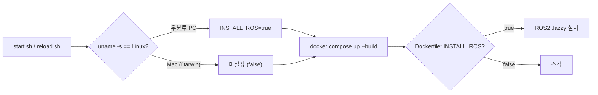

# vscode-tunnel

어디서든 VS Code로 원격 접속할 수 있는 Docker 기반 개발 환경입니다.
Mac(Apple Silicon)과 Ubuntu(x86_64) 모두 별도 수정 없이 동작합니다.

---

## 포함 구성

| 구성 요소 | 버전 / 내용 |
|-----------|------------|
| Base Image | Ubuntu 24.04 (기본값, `.env`의 `BASE_IMAGE`로 CUDA 이미지 등으로 오버라이드 가능) |
| OpenCV | 4.10.0 (소스 빌드, contrib 포함) |
| ROS2 Jazzy | desktop + cv-bridge + image-transport / **Linux 호스트(우분투 PC)에서 빌드 시에만 설치** (v1.13.0+), Mac 미설치 |
| VS Code CLI | stable / 빌드 시 호스트 아키텍처 자동 감지 (arm64, x64) / 매 컨테이너 시작 시 최신 stable 로 자동 갱신 (v1.9.0+) |
| Claude Code | 최신 버전 (native installer) |
| 빌드 도구 | CMake, Ninja, GDB, build-essential |
| SO-ARM101 지원 | `python3-venv`(lerobot venv 생성), `libavdevice60` / `libavfilter9`(torchcodec FFmpeg 런타임), alias `acl` / `so101-teleop` / `so101-help` (v1.15.0+) |

---

## 빠른 시작

### 1. 환경 변수 파일 설정

`.env.sample`을 복사하여 `.env` 파일을 만들고, 값을 설정합니다.

```bash
cp .env.sample .env
```

```env
TUNNEL_NAME=my-dev-tunnel       # 소문자, 숫자, 하이픈만 사용 가능 (전 세계 고유해야 함)
WORKSPACE_PATH=./workspace      # 컨테이너에 마운트할 작업 디렉토리 경로
# 아래는 모두 선택 (미설정 시 기존 동작 그대로):
# BASE_IMAGE=nvidia/cuda:12.6.3-cudnn-devel-ubuntu24.04   # CUDA 학습 환경
# DATASETS_PATH=/data/datasets                            # docker-compose.local.yml과 함께 사용
# TAILSCALE_IP=100.x.y.z                                  # multi-host study-timer 사이드카 활성화
```

| 변수 | 기본값 | 설명 |
|------|-------|------|
| `TUNNEL_NAME` | (필수) | VS Code tunnel 이름. 전 세계 고유해야 함 |
| `WORKSPACE_PATH` | `./workspace` | 컨테이너의 `/workspace`에 마운트할 호스트 경로 |
| `TZ` | `Asia/Seoul` | 컨테이너 timezone (study-timer 날짜 경계용) |
| `BASE_IMAGE` | `ubuntu:24.04` | 빌드 베이스 이미지. CUDA 사용 시 `nvidia/cuda:12.6.3-cudnn-devel-ubuntu24.04` 권장 |
| `DATASETS_PATH` | (미설정) | 데이터셋 호스트 경로. `docker-compose.local.yml`과 함께 사용 |
| `TAILSCALE_IP` | (미설정) | Tailscale IP. 설정 시 `study-timer-http` 사이드카(`:8765`) 자동 동반 기동 |
| `SO101_FOLLOWER_SERIAL` | (미설정) | SO-ARM101 follower 보드의 USB 시리얼 번호. `SO101_LEADER_SERIAL` 과 함께 설정 시 `docker-compose.so101.yml` 자동 적용 (Linux 전용) |
| `SO101_LEADER_SERIAL` | (미설정) | SO-ARM101 leader 보드의 USB 시리얼 번호 |
| `SO101_CAM_WRIST_USB` | (미설정) | SO-ARM101 손목 카메라의 USB 인터페이스 경로 (예: `1-7.1:1.0`, `so101-attach list` 로 확인). 설정 시 `so101-attach` 가 `/dev/so101_cam_wrist` 생성 |
| `SO101_CAM_OVERVIEW_USB` | (미설정) | SO-ARM101 전체 뷰 카메라의 USB 인터페이스 경로. 설정 시 `/dev/so101_cam_overview` 생성 |

> `.env` 파일은 `.gitignore`에 등록되어 있어 Git에 커밋되지 않습니다.

### 2. 컨테이너 빌드 및 실행

```bash
./start.sh
```

`start.sh`가 환경을 자동 감지해 다음 compose 파일을 누적 적용합니다.

| 감지 조건 | 추가 적용 |
|----------|----------|
| (기본) | `-f docker-compose.yml` |
| `nvidia-smi` 동작 | `-f docker-compose.gpu.yml` (GPU 활성화) |
| `/dev/video0` 존재 | `-f docker-compose.camera.yml` (ELP 스테레오 카메라 패스스루) |
| `.env`의 활성 `SO101_FOLLOWER_SERIAL=` / `SO101_LEADER_SERIAL=` 라인 | `-f docker-compose.so101.yml` (SO-ARM101 서보 보드 패스스루) |
| `docker-compose.local.yml` 존재 | `-f docker-compose.local.yml` (머신별 오버라이드, gitignored) |
| `.env`의 활성 `TAILSCALE_IP=` 라인 | `-f docker-compose.tailscale.yml` (study-timer 사이드카) |

Mac에서 `BASE_IMAGE`/`TAILSCALE_IP`/`SO101_*_SERIAL`/local 파일을 모두 미설정 시 기존 동작
(ubuntu:24.04 + 단일 docker-compose.yml)과 완전히 동일합니다.

### 3. VS Code tunnel 인증

컨테이너 최초 실행 시 GitHub 인증이 필요합니다.

```bash
docker compose logs -f
```

로그에 출력되는 URL과 코드를 브라우저에서 입력해 GitHub 계정으로 인증합니다.
인증 정보는 `vscode-cli-data` 볼륨(`/root/.vscode/cli`)에 저장되므로 이후 재시작 시 재인증 불필요합니다.

> VS Code CLI는 keyring이 없는 컨테이너에서 이 토큰을 hostname에 묶어 암호화합니다.
> `docker-compose.yml`의 `hostname: vscode-tunnel` 고정이 함께 있어야 recreate 후에도 토큰을
> 읽을 수 있으며(v1.15.0+), hostname을 바꾸면 1회 재로그인이 필요합니다. 미인증 상태가 5분을
> 넘으면 watchdog가 터널을 재시작해 device 코드가 바뀌므로 최신 코드는
> `docker logs vscode-tunnel 2>&1 | grep "use code" | tail -1` 로 확인합니다.

### 4. 외부에서 접속

- **브라우저**: `https://vscode.dev/tunnel/<TUNNEL_NAME>`
- **VS Code Desktop**: `Remote - Tunnels` 익스텐션에서 터널 이름 선택

---

## 볼륨 구성

```yaml
volumes:
  - ${WORKSPACE_PATH}:/workspace             # 작업 디렉토리 (.env에서 경로 설정)
  - ~/.gitconfig:/root/.gitconfig:ro         # 호스트 git 설정 공유
  - ~/.ssh:/root/.ssh-host:ro                # SSH 키 (entrypoint가 /root/.ssh로 복사하며 권한 보정)
  - vscode-cli-data:/root/.vscode/cli        # tunnel 인증 상태 유지
  - vscode-server-data:/root/.vscode-server  # VS Code 서버/익스텐션 데이터 유지
  - claude-config:/root/.claude              # Claude Code 설정/인증 (컨테이너 전용, 최초 1회 로그인)
  - ~/.claude:/root/.claude-host:ro          # 호스트 Claude 설정 원본 (entrypoint가 CLAUDE.md/settings.json/rules 복사)
  - study-timer-data:/root/.study-timer      # Study Timer 일별 JSON 저장소
  - hf-cache:/root/.cache/huggingface        # HuggingFace 모델 캐시 (recreate 보존)
```

> Claude Code 인증은 호스트와 공유하지 않습니다. 호스트 `~/.claude` 를 그대로
> 마운트하면 컨테이너(root)가 토큰을 갱신할 때 `.credentials.json` 이 root 소유
> 새 파일로 바뀌어 Linux 호스트의 Claude Code 가 읽지 못하고 로그아웃됩니다
> (Mac 은 Docker Desktop 이 bind mount 소유권을 호스트 사용자로 매핑해 증상이
> 없음). 컨테이너를 처음 올린 뒤 한 번만 로그인하면 `claude-config` volume 에
> 남아 `reload.sh` 후에도 유지됩니다. 터널로 연 VS Code 의 Claude 패널에서
> Sign in 을 눌러도 됩니다.
>
> ```bash
> docker compose exec vscode-tunnel claude auth login
> ```
>
> 호스트의 `CLAUDE.md`, `settings.json`, `rules/` 는 컨테이너 시작 시 복사됩니다
> (호스트 -> 컨테이너 단방향). 컨테이너 안에서 바꾼 설정은 호스트로 돌아가지
> 않고 다음 시작 때 호스트 원본으로 덮입니다.

> Timezone은 Dockerfile에서 `Asia/Seoul`로 영구 고정됩니다 (`.env`의 `TZ`로
> 오버라이드 가능). 이전에 사용하던 `/etc/localtime`/`/etc/timezone` bind mount는
> 호스트/컨테이너 측 심볼릭 링크 dereference 차이로 의도와 다르게 동작하여
> v1.7.6에서 제거했습니다.

> `/dev/shm` 은 v1.11.1 부터 `shm_size: 8gb` 로 상향됐습니다 (Docker 기본 64MB).
> PyTorch DataLoader 멀티워커 (`num_workers > 0`) 에서 공유 메모리 부족으로
> `Bus error` 가 나는 문제를 회피하기 위함이며, 호스트 RAM 을 선점하지 않고
> 사용량만큼만 점유합니다.

---

## GPU 지원

NVIDIA GPU가 있는 Ubuntu 환경에서는 `start.sh`가 자동으로 GPU를 활성화합니다.

사전 조건:
- 호스트에 NVIDIA 드라이버 설치
- [NVIDIA Container Toolkit](https://docs.nvidia.com/datacenter/cloud-native/container-toolkit/install-guide.html) 설치

컨테이너 안에서 CUDA 라이브러리(cuDNN 등)가 필요한 경우, **Dockerfile은 손대지
않고 `.env`의 `BASE_IMAGE` 한 줄로 베이스 이미지를 분기**합니다.

```env
# Phase 3/4 학습 권장 (PyTorch 2.5+ / cuDNN / mmcv-full source build 가능)
BASE_IMAGE=nvidia/cuda:12.6.3-cudnn-devel-ubuntu24.04
```

| 용도 | 권장 이미지 |
|------|-----------|
| 학습/추론 (Phase 3/4) | `nvidia/cuda:12.6.3-cudnn-devel-ubuntu24.04` |
| 추론 전용 | `nvidia/cuda:12.6.3-cudnn-runtime-ubuntu24.04` |

Mac은 미설정 → 기본값 `ubuntu:24.04`로 빌드되어 영향 없음.

---

## HuggingFace 캐시 영속화

OpenVLA 7B 등 대용량 모델 가중치(약 14-15GB)를 컨테이너 recreate(`up -d --build`,
`down`+`up`, 설정 변경) 시에도 보존하기 위해 `hf-cache` named volume 을
`/root/.cache/huggingface` 에 마운트합니다 (v1.14.0+).

**증상 (변경 전)**: `HF_HOME` 미설정이라 기본값 `/root/.cache/huggingface` 로 캐시가
떨어지는데, 이 경로가 어떤 volume 에도 마운트돼 있지 않아 writable layer 에 쌓였습니다.
`reload.sh` 가 컨테이너를 recreate 할 때마다 캐시 전체가 폐기되어 매번 14-15GB
재다운로드가 발생했습니다.

**기본 동작 (변경 후)**: `Dockerfile` 의 `ENV HF_HOME=/root/.cache/huggingface` 로
경로를 명시 고정하고, `docker-compose.yml` 의 서비스 volumes 에
`hf-cache:/root/.cache/huggingface` 마운트 + top-level `hf-cache:` 선언(`name: hf-cache`)
을 추가했습니다. 실제 영속화를 만드는 load-bearing 변경은 volume 마운트이고,
`ENV` 는 마운트 지점을 박아 두는 보조 역할입니다.

| 자산 | 위치 | recreate 시 |
|---|---|---|
| HF 모델 캐시 | `/root/.cache/huggingface` (named volume `hf-cache`) | 보존 |
| HF 토큰 (`huggingface-cli login` 사용 시) | `$HF_HOME/token` | 보존 (재로그인 불필요) |

> **한계**: 변경 직후 첫 recreate 1회는 빈 볼륨 초기화라 여전히 재다운로드가
> 발생합니다. 이후 recreate 부터 캐시가 보존됩니다. 또한 nf4 양자화본은 디스크에
> 받는 게 아니라 로드 시점에 bf16 베이스에서 계산되므로, 영속화 대상은 bf16
> 베이스(약 14-15GB)뿐입니다.

**데이터 디스크로 이전 (옵션 B)**: named volume 은 docker data-root
(`/var/lib/docker/volumes`) 하위에 잡힙니다. root 파티션 여유가 부족하면
`.env` 의 `HF_CACHE_PATH` 와 `docker-compose.local.yml` 을 함께 써서 host bind mount
로 데이터 디스크에 둘 수 있습니다.

```env
# .env
HF_CACHE_PATH=/data/hf-cache
```

```yaml
# docker-compose.local.yml (gitignored)
services:
  vscode-tunnel:
    volumes:
      - ${HF_CACHE_PATH}:/root/.cache/huggingface
```

> 동일 target 마운트를 override 가 대체하는 것은 Docker Compose v2 머지 규칙이지만
> 버전/구현에 따라 concat 될 수 있으므로, 적용 전 `docker compose config` 로 머지
> 결과에 `/root/.cache/huggingface` target 이 bind mount 단일로 잡히는지 확인하세요.

**검증**:

```bash
# HF_HOME 고정 확인
docker exec vscode-tunnel printenv HF_HOME
# /root/.cache/huggingface

# 볼륨 생성 확인 (name: hf-cache 고정 덕에 프로젝트 프리픽스 없이 조회됨)
docker volume inspect hf-cache

# 첫 모델 로드 후 용량 확인
docker exec vscode-tunnel du -sh /root/.cache/huggingface/hub
# 약 14-15GB (OpenVLA 7B 기준)
```

Mac 등 HF 모델을 사용하지 않는 호스트에서는 빈 볼륨만 생성되어 무해합니다.

---

## USB 카메라 (ELP 스테레오)

ELP USB 스테레오 카메라(UVC)가 연결된 호스트에서는 `start.sh` / `reload.sh`가
`/dev/video0` 존재를 감지해 `docker-compose.camera.yml`을 자동 적용하고, 카메라
노드를 컨테이너에 패스스루합니다.

```yaml
# docker-compose.camera.yml
services:
  vscode-tunnel:
    devices:
      - /dev/video0:/dev/video0
      - /dev/video1:/dev/video1
    group_add:
      - video
```

**적용 전 노드 확인**: 스테레오 카메라는 좌/우 센서가 각각 video4linux 노드로
잡히며, 노드 번호는 호스트 하드웨어/연결 순서에 따라 달라질 수 있습니다. 호스트에서
실제 노드를 먼저 확인하세요.

```bash
# 카메라 노드 목록
v4l2-ctl --list-devices

# 특정 노드의 지원 포맷/해상도
v4l2-ctl -d /dev/video0 --list-formats-ext
```

노드가 `/dev/video0` / `/dev/video1`과 다르면 `docker-compose.camera.yml`의
`devices` 항목을 실제 노드로 맞춥니다. 존재하지 않는 노드를 매핑하면 컨테이너
기동이 실패합니다.

**적용 / 확인**:

```bash
# 재생성 (devices 는 컨테이너 생성 시점에만 반영, restart 로는 적용 안 됨)
./reload.sh

# 컨테이너 내부에서 노드 인식 확인
docker exec vscode-tunnel ls -l /dev/video*
```

> 카메라가 없는 호스트(Mac 등)에서는 `/dev/video0` 미존재로 오버레이가 적용되지
> 않아 기존 동작과 동일합니다. 컨테이너 안에서 OpenCV 등으로 영상을 다루는 데
> 필요한 추가 패키지는 `Dockerfile` 영역이라 이 오버라이드 범위 밖입니다.

---

## SO-ARM101 서보 보드 (LeRobot)

호스트에서 조립·캘리브레이션을 마친 SO-ARM101 leader/follower 를 컨테이너 안의
lerobot 에서 쓰기 위한 패스스루입니다. 팔은 평소에 빼두고 쓸 때만 꽂는 운용을
전제로, 컨테이너 생성 시점에 장치를 고정하는 `devices` 대신 두 단계로 동작합니다.

1. `docker-compose.so101.yml` 이 USB 시리얼(ttyACM, major 166)과 video4linux(major 81)
   전체에 cgroup 접근 권한만 열어 둡니다. 컨테이너 생성 시 장치가 꽂혀 있을 필요가
   없습니다.
2. 장치를 꽂은 뒤 컨테이너 안에서 `so101-attach` 를 실행하면, 호스트와 공유되는
   sysfs 에서 보드는 USB 시리얼 번호로, 카메라는 USB 인터페이스 경로로 찾아
   `/dev/so101_follower`, `/dev/so101_leader`, `/dev/so101_cam_wrist`,
   `/dev/so101_cam_overview` 노드를 `mknod` 로 만듭니다. 다시 꽂아 `ttyACM` / `video`
   번호가 바뀌어도 재실행하면 갈아 끼웁니다. 컨테이너 재생성이 없습니다.

Linux 호스트 전용입니다 (Docker Desktop for Mac 은 USB 시리얼 패스스루를 지원하지
않음).

**빠른 참조** (컨테이너 안에서 `so101-help` 로 같은 내용 출력):

```bash
so101-attach          # 팔과 카메라를 꽂은 뒤 매번. 노드 4개 생성
so101-attach list     # 보드 시리얼 / 카메라 USB 경로 조회
acl                   # venv 활성화
so101-teleop          # 가이드 7절 텔레옵
so101-help            # 이 요약
```

```yaml
# docker-compose.so101.yml
services:
  vscode-tunnel:
    device_cgroup_rules:
      - "c 166:* rmw"
      - "c 81:* rmw"
    environment:
      - SO101_FOLLOWER_SERIAL=${SO101_FOLLOWER_SERIAL}
      - SO101_LEADER_SERIAL=${SO101_LEADER_SERIAL}
      - SO101_CAM_WRIST_USB=${SO101_CAM_WRIST_USB:-}
      - SO101_CAM_OVERVIEW_USB=${SO101_CAM_OVERVIEW_USB:-}
      - FOLLOWER_PORT=/dev/so101_follower
      - LEADER_PORT=/dev/so101_leader
      - HF_LEROBOT_CALIBRATION=/root/so-arm101/calibration
    volumes:
      - ./so101-attach.sh:/usr/local/bin/so101-attach:ro
      - ~/Documents/so-arm101/calibration:/root/so-arm101/calibration
```

**1. 보드 시리얼 번호 확인** (호스트, 팔 2대 USB 연결 후):

```bash
ls -l /dev/serial/by-id/
# usb-1a86_USB_Single_Serial_XXXXXXXXXX-if00 -> ../../ttyACM0
# usb-1a86_USB_Single_Serial_YYYYYYYYYY-if00 -> ../../ttyACM1
```

`Serial_` 뒤의 10자리가 시리얼 번호입니다. 어느 쪽이 follower 인지는 한쪽 USB 를
뽑고 다시 실행해 사라지는 항목으로 판별합니다 (조립 가이드 4.1절).

**2. `.env` 설정** (따옴표 없이):

```env
SO101_FOLLOWER_SERIAL=XXXXXXXXXX
SO101_LEADER_SERIAL=YYYYYYYYYY
```

**3. 적용** (팔이 꽂혀 있지 않아도 됨):

```bash
# .env 변경으로 컨테이너가 1회 재생성됨 (터널이 잠시 끊김)
./start.sh

# 확인
docker inspect vscode-tunnel --format '{{.HostConfig.DeviceCgroupRules}}'   # [c 166:* rmw]
docker exec vscode-tunnel printenv FOLLOWER_PORT LEADER_PORT HF_LEROBOT_CALIBRATION
docker exec vscode-tunnel ls /root/so-arm101/calibration/robots/so_follower
```

**4. lerobot 설치** (컨테이너 안, 최초 1회):

lerobot 은 numpy 2.x 를 요구하는데 이미지의 시스템 Python 은 소스 빌드 OpenCV 가
numpy 1.26 에 링크되어 있어, 시스템에 설치하면 `cv2` 가 깨집니다. `/workspace/venvs`
아래 별도 venv 에 설치합니다. `/workspace` 는 bind mount 라 컨테이너 recreate 후에도
남습니다. 버전은 호스트 `~/lerobot` 체크아웃과 같은 커밋으로 고정합니다 (torch 포함
수 GB 를 받으므로 시간이 걸립니다). venv 생성에 필요한 `python3-venv` 와 torchcodec 이
요구하는 FFmpeg 런타임 `libavdevice60` / `libavfilter9` 는 이미지에 들어 있습니다.

```bash
python3 -m venv /workspace/venvs/lerobot
/workspace/venvs/lerobot/bin/pip install \
    "lerobot[core_scripts,feetech] @ git+https://github.com/huggingface/lerobot.git@b6ec0060779550c0a157ae34feb89e0cf86012a8"

# 확인
source /workspace/venvs/lerobot/bin/activate
python -c "import torch; print(torch.__version__, torch.cuda.is_available())"
lerobot-teleoperate --help
```

VS Code 터미널은 venv 를 자동 활성화하지 않습니다. 세션마다 `acl`(이미지의
`/root/.bashrc` 에 정의된 alias, `source /workspace/venvs/lerobot/bin/activate` 와
같음)을 실행하거나, Python 확장의 인터프리터 선택에서
`/workspace/venvs/lerobot/bin/python` 을 지정해 새 터미널이 자동 활성화되게 합니다.

**5. 사용 절차** (매번):

```bash
# 1) 호스트: 팔 2대의 USB 와 DC 전원 연결 (USB 만으로는 서보에 전원이 가지 않음, 조립 가이드 2.3절)

# 2) 컨테이너 터미널: 노드 생성 (호스트에서는 docker exec vscode-tunnel so101-attach)
so101-attach
# [so101-attach] /dev/so101_follower -> ttyACM0 (166:0)
# [so101-attach] /dev/so101_leader -> ttyACM1 (166:1)
# [so101-attach] /dev/so101_cam_wrist -> video2 (81:2)       <- 6번에서 카메라를 설정한 경우
# [so101-attach] /dev/so101_cam_overview -> video0 (81:0)

# 3) 텔레옵: acl 로 venv 를 켠 뒤 alias 실행 (포트와 캘리브레이션 위치는 환경변수로 이미 잡혀 있음)
acl
so101-teleop
```

`so101-teleop` 은 이미지의 `/root/.bashrc` 에 정의된 alias 로, 다음 명령과 같습니다
(`id` 는 캘리브레이션 파일명과 같아야 합니다).

```bash
lerobot-teleoperate \
    --robot.type=so101_follower \
    --robot.port=$FOLLOWER_PORT \
    --robot.id=so101_follower_01 \
    --teleop.type=so101_leader \
    --teleop.port=$LEADER_PORT \
    --teleop.id=so101_leader_01
```

**6. 카메라** (손목 카메라 + 전체 뷰 카메라, 선택):

카메라도 같은 attach 방식으로 넘깁니다. 웹캠은 USB 시리얼이 고유하지 않은 경우가 많아
USB 인터페이스 경로로 식별하므로, 카메라는 항상 같은 USB 포트에 꽂습니다. UVC 카메라는
노드가 2개(캡처 + 메타데이터) 생기는데 캡처 노드만 잡습니다.

```bash
# 값 확인 (컨테이너 안, 카메라 연결 후). usb= 값을 .env 에 적는다
so101-attach list
# cameras, capture nodes only (value for SO101_CAM_WRIST_USB / SO101_CAM_OVERVIEW_USB):
#   video0 usb=1-2.2:1.0 name="3D Global Shutter Camera: 3D Gl"
#   video2 usb=1-7.1:1.0 name="USB Camera: USB Camera"
```

```env
SO101_CAM_WRIST_USB=1-7.1:1.0
SO101_CAM_OVERVIEW_USB=1-2.2:1.0
```

```bash
./start.sh          # .env 변경으로 컨테이너 1회 재생성
so101-attach        # 이후 카메라 노드 2줄이 추가로 출력됨
```

lerobot 명령에는 노드 경로를 그대로 넣습니다. 요청한 fps 와 크기는 카메라가 지원하는
값과 정확히 같아야 하며(lerobot 이 실제 값과 대조한 뒤 예외), 지원 값은 호스트에서
`v4l2-ctl -d /dev/videoN --list-formats-ext` 로 확인합니다. 아래는 이 저장소 작성
환경의 값입니다. 손목(Realtek USB Camera)은 MJPG 640x480 @ 30fps, 전체 뷰(ELP
스테레오)는 좌우 병치 MJPG 1280x480 @ 60fps 이며 ELP 는 30fps 를 지원하지 않습니다.

```bash
lerobot-record \
    --robot.type=so101_follower \
    --robot.port=$FOLLOWER_PORT \
    --robot.id=so101_follower_01 \
    --robot.cameras="{ wrist: {type: opencv, index_or_path: /dev/so101_cam_wrist, width: 640, height: 480, fps: 30, fourcc: MJPG}, overview: {type: opencv, index_or_path: /dev/so101_cam_overview, width: 1280, height: 480, fps: 60, fourcc: MJPG} }" \
    --teleop.type=so101_leader \
    --teleop.port=$LEADER_PORT \
    --teleop.id=so101_leader_01 \
    --dataset.repo_id=<hf_user>/<dataset_name> \
    --dataset.single_task="<task description>" \
    --dataset.fps=30 \
    --dataset.num_episodes=5 \
    --dataset.push_to_hub=false
```

`--dataset.push_to_hub` 의 기본값은 `true` 라 Hub 업로드를 원치 않으면 명시적으로
끕니다. 데이터셋 기본 저장 위치는 `$HF_HOME/lerobot`(hf-cache 볼륨 안)이며 위치 결정은
이 오버라이드 범위 밖입니다.

> ELP 는 기존 카메라 오버레이(`/dev/video0`, `/dev/video1`)와 `/dev/so101_cam_overview`
> 두 이름으로 보입니다. 같은 장치를 두 프로세스가 동시에 열지 마세요.

> `so101-attach` 가 `not found` 를 내면 그 장치의 USB 가 안 꽂힌 것입니다. 찾은 장치의
> 노드는 만들어지므로 follower 만 꽂은 상태에서는 follower 노드만 생기고 종료 코드는
> 1 입니다. 장치를 뽑은 뒤에는 노드가 남아 있지만 열면 실패하며, 다음 `so101-attach` 가
> 정리합니다.

> 호스트 conda 환경의 lerobot 과 컨테이너의 lerobot 을 같은 포트에 동시에 붙이지
> 마세요. 시리얼 포트는 배타 잠금이 없어 패킷이 섞입니다.

> 컨테이너 안에서 `lerobot-calibrate` 로 캘리브레이션을 새로 쓰면 호스트 파일이
> root 소유가 됩니다. 필요 시 `sudo chown -R $USER ~/Documents/so-arm101/calibration`.
> 조립 가이드 6.4절의 `Homing_Offset` 복구 스니펫을 컨테이너에서 쓸 때는 포트
> 문자열에 `/dev/ttyACM1` 대신 `/dev/so101_follower` 등 컨테이너 노드 경로를 넣습니다.

> `lerobot-record` 의 키보드 조작은 컨테이너에 `DISPLAY` 가 없어 pynput 대신 stdin
> 으로 동작합니다. VS Code 터미널이나 `docker exec -it` 처럼 TTY 가 있어야 하며,
> 백그라운드 실행에서는 키 입력을 받지 못합니다. 기록되는 데이터셋의 기본 위치는
> `$HF_HOME/lerobot`(hf-cache 볼륨 안)이며 위치 결정은 이 오버라이드 범위 밖입니다.

> 변수가 없는 호스트(Mac 등)에서는 오버레이가 적용되지 않아 기존 동작과 동일합니다.

---

## ROS2 Jazzy (우분투 PC 전용)

베이스 이미지가 Ubuntu 24.04 (noble)이므로, noble 공식 바이너리가 제공되는 **ROS2
Jazzy**를 설치합니다. (Humble은 22.04 jammy 타깃이라 24.04 베이스에 부적합)

설치 대상은 ROS2 데스크톱 풀셋 + 영상 처리에 필요한 두 패키지입니다.

- `ros-jazzy-desktop`
- `ros-jazzy-cv-bridge`
- `ros-jazzy-image-transport`

**Linux 호스트에서만 자동 설치**: ROS는 이미지 용량을 수 GB 늘리므로 Mac에는
설치하지 않습니다. `start.sh` / `reload.sh`가 `uname -s`로 호스트 OS를 판별해,
Linux(우분투 PC)일 때만 `INSTALL_ROS=true`를 export하여 빌드에 반영합니다.
Mac(Darwin)에서는 미설정으로 남아 `docker-compose.yml`의 기본값 `false`로 스킵됩니다.



별도 `.env` 설정 없이 호스트 OS만으로 자동 분기됩니다. 설치 시 `/root/.bashrc`에
`source /opt/ros/jazzy/setup.bash`가 추가되어 VS Code 터미널(bash)에서 `ros2`
명령이 바로 동작합니다.

**적용 / 확인** (우분투 PC):

```bash
# 이미지 재빌드 (ROS desktop 은 용량이 커 최초 빌드 시간이 오래 걸림)
./reload.sh

# 설치 확인
docker exec vscode-tunnel bash -lc 'source /opt/ros/jazzy/setup.bash && ros2 --version'
```

> **OpenCV 중복 주의**: 이 이미지는 OpenCV 4.10을 소스 빌드해 `/usr/local`에
> 설치합니다. 반면 `ros-jazzy-cv-bridge`는 apt 의존성으로 noble 시스템
> OpenCV(4.6)를 함께 끌어옵니다. cv-bridge(C++ 노드)는 apt OpenCV에, Python
> `cv2`는 소스 빌드 4.10에 링크되는 이원 구조가 됩니다. 보통 공존 가능하나
> 동일 프로세스에서 두 버전을 섞으면 충돌 소지가 있습니다.

---

## 머신별 오버라이드 패턴

머신별 차이(데이터셋 경로, multi-host 사이드카 등)를 git 충돌 없이 흡수하기 위한
세 축 분기.

| 축 | 파일 / 변수 | git 상태 | 활성화 조건 |
|----|------------|---------|----------|
| 베이스 이미지 | `.env`의 `BASE_IMAGE` | gitignored | `.env`에 값 설정 |
| GPU | `docker-compose.gpu.yml` | commit | `nvidia-smi` 동작 |
| USB 카메라 | `docker-compose.camera.yml` | commit | `/dev/video0` 존재 |
| SO-ARM101 서보 보드 | `docker-compose.so101.yml` + `so101-attach.sh` + `.env`의 `SO101_FOLLOWER_SERIAL` / `SO101_LEADER_SERIAL` | commit (파일) / gitignored (값) | `.env`에 두 변수 설정. 노드는 팔을 꽂은 뒤 `so101-attach` 로 생성 |
| 머신별 마운트 | `docker-compose.local.yml` | gitignored | 파일 존재 |
| HF 캐시 위치 | `docker-compose.local.yml` + `.env`의 `HF_CACHE_PATH` | gitignored | `.env`에 `HF_CACHE_PATH` 설정 (미설정 시 named volume `hf-cache` 사용) |
| Multi-host 사이드카 | `docker-compose.tailscale.yml` + `.env`의 `TAILSCALE_IP` | commit (파일) / gitignored (값) | `.env`에 `TAILSCALE_IP` 설정 |

Ubuntu 학습 호스트의 전형적 셋업 절차는 [UBUNTU_SETUP.md](UBUNTU_SETUP.md) 참조.
Multi-host study-timer 통합 설계는 nanobot-docker 리포의 `multi-host-plan.md` 참조.

---

## 터널 이름 변경

`.env` 파일의 `TUNNEL_NAME`을 수정하고 컨테이너를 재시작합니다.

```bash
docker compose down
./start.sh
```

> 터널 이름은 소문자, 숫자, 하이픈만 허용되며 전 세계적으로 고유해야 합니다.

---

## 컨테이너 중지 / 재시작

```bash
# 중지
docker compose down

# 재시작 (in-place, 이미지 재빌드 포함, 변경된 컨테이너만 recreate)
./start.sh

# 안전 재기동 (down 후 up, 이미지 재빌드 포함, 좀비 네트워크/사이드카까지 정리)
./reload.sh
```

두 스크립트의 차이는 `docker compose down`을 먼저 거치는지 여부입니다. `start.sh`는
in-place 갱신이라 변경된 컨테이너만 recreate되어 빠르지만, 옛 docker network ID를
들고 있는 좀비 사이드카 같은 정합성 문제는 자동 정리되지 않습니다. `reload.sh`는
같은 `COMPOSE_ARGS`(모든 compose 오버레이)로 `down` 후 `up -d --build`를 실행하여
전체 컨테이너/네트워크를 깨끗하게 갈아엎으므로 정합성까지 회복합니다. named volume에
저장된 데이터는 양쪽 모두 보존됩니다.

`reload.sh`는 v1.9.0 부터 마지막 단계에서 entrypoint 로그를 자동으로 추려 출력합니다.
`Dockerfile` / `entrypoint.sh` / `extensions/` 등 이미지에 burn-in 되는 자산을 수정한
뒤에도 `./reload.sh` 한 번으로 down -> build -> up -> 검증까지 끝납니다.

```
Verifying entrypoint output...
[entrypoint] vscode CLI refreshed: code 1.122.0 (commit 6a49527...)
[entrypoint] SSH 키 복사 및 권한 보정 완료
[entrypoint] study-timer extension 배치 및 등록 완료

Container status:
NAMES           STATUS
vscode-tunnel   Up 8 seconds (healthy)
```

**언제 어느 쪽을 쓰나:**

| 변경 유형 | 권장 스크립트 |
|---|---|
| `.env` 만 변경 (TUNNEL_NAME 등) | `docker compose down && ./start.sh` |
| `docker-compose*.yml` 만 변경 | `./start.sh` (in-place recreate) |
| `Dockerfile` / `entrypoint.sh` / extension 소스 변경 | **`./reload.sh`** (down + build + 검증) |
| 좀비 사이드카 / 네트워크 정합성 복구 | **`./reload.sh`** |

---

## Study Timer

특정 워크스페이스에서의 실사용 시간을 자동 측정하여 일별 JSON 파일로 저장하는 내장 VS Code extension입니다.

### 대상 워크스페이스
- 컨테이너 내부 경로: `/workspace/study/physical-ai-study`
- 이 경로가 최상위 폴더인 VS Code 창에서만 활성화됩니다.

### 측정 규칙
- **Active 조건**: 창 focus 상태 + 최근 idle 임계 내 활동(편집 / 커서 이동 / 에디터 전환 / focus 복귀)
- **idle 임계**: 활성 탭이 markdown preview(미리 보기) 이면 20분, 그 외 모든 탭(텍스트 에디터 / 노트북 / 기타 webview) 은 5분 (v1.10.1+). 미리 보기는 webview 내부 활동 신호가 API 로 노출되지 않아 동일 임계 적용이 부당하다는 점을 보정 — 자리 비움 시 최대 20분까지 시간이 부풀려질 수 있음
- 1초 단위로 `active_seconds` 누적, 30초 주기로 파일에 atomic write
- idle로는 세션이 끊기지 않고 카운트만 중단되므로, PC를 옮기거나 자리를 비워도 자연스럽게 측정 중단됩니다.
- 자정을 넘기면 세션을 두 파일로 분할 기록합니다.
- 각 extension 활성화(activate)는 자기만의 `instance_id`로 표시된 세션을 새로 추가하며, flush 시 자기 세션의 `active_seconds`/`end`만 갱신합니다. 같은 워크스페이스를 두 VS Code 창에서 열어도 각 창이 독립된 세션을 가지므로 충돌 없이 합산됩니다. reload로 0초짜리 세션이 남는 경우 `deactivate` 시 정리합니다.

### Phase/Week 집계 (`by_phase_week`)
- 1초 tick마다 현재 활성 에디터(텍스트 또는 노트북)의 파일 경로를 확인해 카테고리별 누적 초를 함께 기록합니다.
- 카테고리 키 규칙
  - `Studies/Phase N/weekM/...` 하위 파일 -> `"Phase N/weekM"`
  - `Studies/Hardware-Arm/stageN/...` 하위 파일 -> `"Hardware-Arm/stageN"`
  - 그 외(Roadmap, README, Hardware-Arm 최상위 문서, 활성 에디터 없음 등) -> `"other"`
- 활성 탭이 markdown preview(미리 보기) 인 경우에도 원본 `.md` 파일의 카테고리로 귀속됩니다 (v1.10.0+). 가장 최근에 활성화되었던 `.md` 경로를 추적해 미리 보기 탭 라벨의 파일명과 basename 으로 검증한 뒤 매칭합니다. 미리 보기 탭의 idle 임계는 20분으로 확장되어 (v1.10.1+) 장문 markdown 읽기 세션이 5분 임계로 끊기지 않도록 합니다.
- 불변식: `active_seconds == sum(by_phase_week.values())`
- nanobot/MCP 쪽에서는 `other`를 집계에서 제외하고 `Phase N/weekM` / `Hardware-Arm/stageN` 키만 사용하는 것을 권장합니다.

### "other" 카테고리 상세 (`other_breakdown`, v1.11.0+)
- `by_phase_week.other` 가 단일 합산값이라 "그 시간에 뭘 봤는지" 추적이 불가능했던 한계를 보완합니다.
- 키 포맷
  - 워크스페이스 내부 파일: workspace-relative POSIX 경로 (예: `Studies/Roadmap.md`)
  - 워크스페이스 외부 파일: absolute path 그대로
  - 활성 에디터 없음: `(no active editor)` sentinel
  - 구버전 마이그레이션: `(legacy unattributed)` sentinel (실제 내역 복구 불가)
- 불변식: `sum(other_breakdown.values()) == by_phase_week.other`. 매 `other` tick 에서 `by_phase_week.other` 와 `other_breakdown` 키가 같은 if 블록 안에서 함께 +1
- 사용 예: nanobot MCP 측 신규 도구 `get-study-other-breakdown` 으로 명시적 요청 시에만 노출. 기존 도구 (`get-today` / `get-date` / `get-study-phase-week` 등) 의 응답 형식은 변경 없음

### 저장 경로 / 포맷
- 경로: `/root/.study-timer/YYYY-MM-DD.json` (docker named volume `study-timer-data`)
- 컨테이너 timezone(`Asia/Seoul`, Dockerfile에서 고정)을 사용하므로 모든 타임스탬프와 날짜 경계는 로컬 TZ 기준입니다.

```json
{
  "date": "2026-04-14",
  "workspace": "physical-ai-study",
  "active_seconds": 5400,
  "by_phase_week": {
    "Phase 1/week2": 3000,
    "Phase 2/week1": 1000,
    "Hardware-Arm/stage1": 1000,
    "other": 400
  },
  "other_breakdown": {
    "Studies/Roadmap.md": 250,
    "README.md": 100,
    "(no active editor)": 50
  },
  "sessions": [
    {
      "start": "2026-04-14T09:00:00+09:00",
      "end": "2026-04-14T10:30:00+09:00",
      "active_seconds": 5400
    }
  ],
  "last_updated": "2026-04-14T10:30:15+09:00"
}
```

### 외부 컨테이너에서 공유 (예: nanobot-docker)

`study-timer-data` named volume을 `external: true`로 참조하면 다른 compose 프로젝트에서 읽어갈 수 있습니다.

```yaml
services:
  my-service:
    volumes:
      - study-timer-data:/data/study-timer:ro
volumes:
  study-timer-data:
    external: true
```

vscode-tunnel 컨테이너를 먼저 기동해 볼륨이 생성된 이후에 nanobot compose를 올리면 됩니다.

### Multi-host HTTP 노출 (`study-timer-http` 사이드카)

`.env`에 `TAILSCALE_IP`가 설정된 호스트에서는 `study-timer-http` 사이드카가 자동
기동되어 `http://${TAILSCALE_IP}:8765/`로 `study-timer-data` 볼륨의
`YYYY-MM-DD.json` 파일을 nginx autoindex(JSON)로 노출합니다.

| 항목 | 내용 |
|------|------|
| 노출 IP | `${TAILSCALE_IP}` (Tailnet 인터페이스에만 바인딩, LAN/외부 차단) |
| 포트 | `8765` → 컨테이너 `:80` |
| 응답 | `study-timer-data` 볼륨의 `YYYY-MM-DD.json` 파일 (read-only) |
| 헬스체크 | `wget http://127.0.0.1/` 1분 주기 (IPv4 명시) |

> 헬스체크가 `localhost` 대신 `127.0.0.1`을 쓰는 이유: nginx alpine은 read-only
> bind-mount된 `default.conf` 때문에 IPv6 listener를 추가하지 못해 IPv4-only로
> listen 합니다. busybox wget이 `localhost`를 IPv6(`::1`)로 먼저 시도하면 fallback
> 없이 실패하여 false `unhealthy`가 발생합니다 (v1.7.5 fix).

---

## 자동 복구 (Watchdog)

`entrypoint.sh`가 watchdog으로 동작하며, 120초마다 터널 상태를 감시합니다.

| 검사 항목 | 설명 |
|-----------|------|
| GitHub 토큰 만료 | 터널 로그(`/tmp/tunnel.log`)에서 `access token is no longer valid` / `Bad credentials` 메시지 감지 |
| 프로세스 생존 | 터널 프로세스가 살아있는지 확인 |
| 프로세스 중복 | `code tunnel` 프로세스가 2개 이상이면 비정상 |
| 터널 상태 | `code tunnel status`의 상태가 `Connected`인지 확인 |
| 릴레이 단절 미복구 | 터널 로그의 마지막 단절 마커(`Tunnel exited unexpectedly` / `Error refreshing access token, will retry`) 이후 회복 흔적 없이 300초(`RECONNECT_GRACE`) 이상 지나면 비정상. `status`가 stale `Connected`를 반환하는 경우를 보완 (v1.15.0) |

- 비정상 감지 시 터널을 자동 재시작합니다.
- 3회 연속 복구 실패 시 컨테이너를 종료하고, Docker의 `restart: unless-stopped` 정책으로 컨테이너 자체가 재시작됩니다.
- 초기 시작 후 5분간은 grace period를 적용하여 GitHub 인증 대기 중 오탐을 방지합니다.
- **GitHub 토큰 만료**는 재시작/컨테이너 종료로 고쳐지지 않으므로(같은 죽은 토큰 재사용) 예외 처리합니다. `code tunnel status`는 토큰 만료 후에도 stale `Connected`를 반환하므로, 터널 로그를 직접 grep 하여 만료를 감지합니다. 감지 시 재시도 카운트를 올리지 않고 컨테이너를 유지한 채 터널만 재시작해 새 device code를 재발급합니다 (v1.14.1). 재인증:
  ```bash
  docker compose exec vscode-tunnel code tunnel user login --provider github
  ```

---

## VS Code CLI 자동 갱신

이미지에 burn-in 된 `code` 바이너리는 빌드 시점에 고정되어 시간이 지날수록 클라이언트
(vscode.dev / VS Code Desktop) 와 격차가 누적될 수 있습니다. v1.9.0 부터 `entrypoint.sh`
의 `refresh_vscode_cli()` 가 매 컨테이너 시작 시 stable 채널의 최신 CLI 를 받아
`/usr/local/bin/code` 를 덮어씁니다.

| 항목 | 동작 |
|---|---|
| 갱신 시점 | 컨테이너 시작 시 (tunnel 기동 직전) |
| 다운로드 URL | `https://code.visualstudio.com/sha/download?build=stable&os=cli-alpine-${ARCH}` |
| 타임아웃 | `curl --max-time 30` (네트워크 hang 차단) |
| 백업 | 직전 CLI 를 `/usr/local/bin/code.prev` 로 보존 |
| 실패 fallback | 다운로드/추출 실패 시 이미지 burn-in 본 CLI 를 그대로 사용 |

**호환성**: VS Code tunnel 은 클라이언트가 요청한 commit hash 의 server 를 CLI 가
다운로드/실행하는 구조이므로 **CLI 가 클라이언트보다 같거나 더 최신** 이면 일반적으로
호환됩니다. 옛 클라이언트로 접속해도 해당 commit 의 server 가 별도로 받아져
`/root/.vscode/cli/servers/Stable-<hash>/` 에 누적되므로 문제 없습니다.

**문제 발생 시 롤백**:

```bash
docker exec vscode-tunnel mv /usr/local/bin/code.prev /usr/local/bin/code
docker exec vscode-tunnel code tunnel restart
```

최후 수단으로 `docker compose up -d --force-recreate` 시 entrypoint 가 다시 최신
다운로드를 시도하며, 그것도 실패하면 이미지 burn-in CLI 로 fallback.

---

## 파일 구성

```
.
├── Dockerfile                    # 이미지 정의 (multi-stage: extension builder + ${BASE_IMAGE} 런타임)
├── docker-compose.yml            # 컨테이너 실행 설정 (build args에 BASE_IMAGE 주입)
├── docker-compose.gpu.yml        # NVIDIA GPU 오버라이드 (start.sh 자동 적용)
├── docker-compose.camera.yml     # ELP USB 스테레오 카메라 패스스루 (/dev/video0 시 자동 적용)
├── docker-compose.so101.yml      # SO-ARM101 서보 보드 패스스루 (.env SO101_*_SERIAL 설정 시 자동 적용)
├── so101-attach.sh               # 컨테이너 안에서 sysfs 시리얼 매칭으로 /dev/so101_* 노드 생성 (bind mount)
├── docker-compose.tailscale.yml  # study-timer-http 사이드카 (TAILSCALE_IP 시 자동 적용)
├── docker-compose.local.yml      # 머신별 마운트 등 로컬 오버라이드 (gitignored)
├── study-timer-nginx.conf        # 사이드카 nginx 설정 (autoindex JSON, no-cache)
├── start.sh                      # GPU/local/tailscale 자동 감지 시작 스크립트 (in-place recreate)
├── reload.sh                     # 안전 재기동: down -> build -> up -> entrypoint 검증 출력
├── entrypoint.sh                 # 터널 watchdog + VS Code CLI 자동 갱신 + Study Timer extension 배치
├── extensions/
│   └── study-timer/              # 실사용 시간 측정 VS Code extension (TypeScript)
├── UBUNTU_SETUP.md               # Ubuntu 학습 호스트 독립 배포 가이드
├── .env                          # 환경 변수 - Git 미포함
├── .env.sample                   # 환경 변수 템플릿 - Git 포함
├── .gitignore                    # .env, workspace/, docker-compose.local.yml 등 제외
└── workspace/                    # 컨테이너에 마운트되는 작업 디렉토리 - Git 미포함
```
