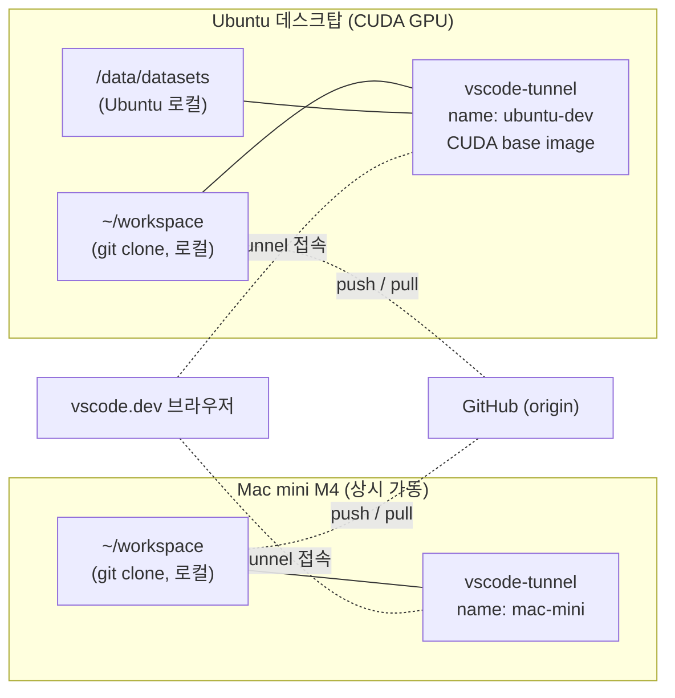

# Ubuntu 데스크탑 독립 배포 가이드 (CUDA 활용용)

Mac mini(M4)와 Ubuntu 데스크탑에 vscode-tunnel을 **독립적으로** 배포하여,
같은 코드를 양쪽에서 작업할 수 있게 구성하는 절차입니다.

- 평소 개발은 Mac mini tunnel
- CUDA가 필요한 학습/실험은 Ubuntu tunnel
- workspace는 각 머신의 로컬 디스크에 별도 보유, **git으로 동기화** (SMB 등 파일 공유 없음)
- 데이터셋은 Ubuntu 로컬 디스크에 별도 배치 (대용량 I/O가 네트워크 영향 받지 않도록)
- study-timer 기록 통합은 Tailscale + HTTP 사이드카로 별도 처리
  (자세한 내용은 nanobot-docker 리포의 `multi-host-plan.md` 참조)

## 설계 결정: 왜 독립 배포인가

이전 안은 Mac의 workspace를 SMB로 Ubuntu에 마운트하는 단일 소스 모델이었으나
다음 이유로 독립 배포로 전환했습니다.

- Mac 슬립/재부팅이 Ubuntu 작업을 멈추게 만드는 의존성 제거
- mfsymlinks, automount, `.local` 해석, 권한 매핑 등 SMB 운영 부담 제거
- study-timer 통합 계획(nanobot-docker 리포의 `multi-host-plan.md`)이 채택한
  "각 머신은 자기 데이터를 자기 볼륨에 쓴다" 원칙과 일관됨
- 1GbE 네트워크 병목이 워크스페이스 I/O에서도 사라짐

비용은 단 하나: **미커밋 변경은 머신 간 자동 이동하지 않음**.
이는 코드 동기화 흐름(아래 섹션)으로 다룬다.

## 구성 개요



## 사전 조건

- 양쪽 머신 모두 GitHub에 SSH 키 등록 완료 (clone/push 가능)
- Ubuntu에 NVIDIA 드라이버 + NVIDIA Container Toolkit 설치 완료
- 양쪽 머신 모두 Docker + Docker Compose v2 plugin 설치 완료
- 사용자가 `docker` 그룹에 가입되어 sudo 없이 docker 실행 가능
- NTP로 시계 동기화됨 (`timedatectl status`로 확인)
- 시간대(`TZ`)를 양쪽 동일하게 (`Asia/Seoul`) — study-timer 날짜 경계 일관성

기존에 vscode-tunnel을 운영하던 호스트는 위 항목들이 보통 이미 충족되어 있음.
신규 Ubuntu 호스트라면 위 순서대로 셋업 후 다음 단계로 진행.

## 코드 동기화 흐름

각 머신은 독립된 git working tree를 가집니다. 이동은 항상 git을 통해.

- 머신 A에서 작업 → commit → push → 머신 B에서 pull
- **미커밋 변경(스테이지/스태시 포함)은 자동으로 따라오지 않음.**
  필요 시 WIP 커밋으로 잠시 push 한 뒤 반대편에서 pull → `git reset HEAD~1`로 풀어 사용
- `.env`, `.vscode/settings.json`, 빌드 산출물 등 git에 안 들어가는 파일은 머신별로 별도 관리
- 자주 머신을 오가는 작업이 잦으면 `mac-wip`, `ubu-wip` 같은 머신별 임시 브랜치 운용 검토

## 1. Mac mini 설정

기존 vscode-tunnel 구성을 그대로 사용. 본 가이드에서 별도 변경 사항 없음.

## 2. Ubuntu 사전 준비

### 2-1. workspace 디렉토리 준비
```bash
mkdir -p ~/workspace
cd ~/workspace
git clone git@github.com:tylee-yeonge/<프로젝트>.git
```

위치는 어디든 무관. 이 경로가 Ubuntu vscode-tunnel의 `WORKSPACE_PATH`가 됩니다.

### 2-2. 데이터셋 디렉토리 준비 (선택)
대용량 학습 데이터셋은 로컬 NVMe에 둡니다.

```bash
sudo mkdir -p /data/datasets
sudo chown $USER:$USER /data/datasets
```

## 3. vscode-tunnel Ubuntu 배포

### 3-1. 리포지토리 clone
```bash
git clone git@github.com:tylee-yeonge/vscode-tunnel.git
cd vscode-tunnel
```

### 3-2. .env 작성
```env
TUNNEL_NAME=ubuntu-dev
WORKSPACE_PATH=/home/<user>/workspace
TZ=Asia/Seoul
BASE_IMAGE=nvidia/cuda:12.6.3-cudnn-devel-ubuntu24.04
DATASETS_PATH=/data/datasets
# TAILSCALE_IP=100.x.y.z   # 3-5 사이드카 활성화 시 코멘트 해제
```

- `TUNNEL_NAME`은 Mac(`mac-mini`)과 달라야 함 (전 세계 고유)
- `WORKSPACE_PATH`는 **절대경로** 권장 (2-1에서 만든 경로)
- `TZ`는 Mac과 동일해야 study-timer 타임스탬프/날짜 경계가 양쪽에서 일관됨
- `BASE_IMAGE` / `DATASETS_PATH` / `TAILSCALE_IP` 자세한 의미는 `.env.sample` 주석
  또는 아래 3-3 / 3-4 / 3-5 참조

### 3-3. CUDA 베이스 이미지 (`BASE_IMAGE`)
`.env`의 `BASE_IMAGE` 한 줄로 분기. Dockerfile은 commit된 한 벌만 유지 (Mac은
미설정 시 기본값 `ubuntu:24.04`).

권장: **`nvidia/cuda:12.6.3-cudnn-devel-ubuntu24.04`**

- CUDA 12.6 + cuDNN 9 + devel + ubuntu 24.04 (Mac 기본 OS와 동일 → 한 Dockerfile
  양쪽 빌드 가능)
- NVIDIA Hub에서 ubuntu24.04 + cudnn-devel 변종은 12.6.0부터 발행됨. 12.6.3은
  12.6 시리즈의 안정 패치 마지막 버전
- Phase 3/4 의존성(PyTorch 2.6, ultralytics, transformers, mmcv-full 등)을
  포괄적으로 커버. mmcv-full은 사전 빌드 wheel 부재 시 source build 필요하나
  devel 이미지라 가능
- 드라이버 ≥ 560 충족 시 동작 (RTX 4070 + driver 580 OK)

### 3-4. 데이터셋 볼륨 마운트 (선택, `DATASETS_PATH`)
머신별 호스트 경로를 git에 commit하지 않기 위해 `docker-compose.local.yml`(gitignored)
패턴을 사용. 리포 루트에 다음 파일 작성:

```yaml
# docker-compose.local.yml (Ubuntu 로컬 전용, gitignored)
services:
  vscode-tunnel:
    volumes:
      - ${DATASETS_PATH:-/data/datasets}:/datasets
```

`.env`의 `DATASETS_PATH`로 호스트 경로 분기 (`/data/datasets` 등). 컨테이너 내부
경로는 항상 `/datasets`로 고정 → 코드에서 `/datasets/kitti/` 같은 절대경로 참조가
Mac/Ubuntu 양쪽에서 일관됨.

### 3-5. Study Timer 사이드카 활성화 (선택, `TAILSCALE_IP`)
nanobot-docker 리포의 `multi-host-plan.md` Phase 1 연계. 양쪽 머신의 study-timer
JSON을 nanobot이 통합 응답하기 위한 read-only nginx 사이드카(`:8765`)를 띄움.

```bash
tailscale ip -4   # 100.x.y.z 형태의 IP 확인
# .env의 TAILSCALE_IP=... 라인 활성화 (위 IP 박기)
```

이후 단계 3-6의 `./start.sh`가 자동으로 `-f docker-compose.tailscale.yml`을 얹어
사이드카를 함께 기동.

### 3-6. 기동 및 인증
```bash
./start.sh
docker logs vscode-tunnel | grep "use code"
```
- start.sh는 다음을 자동 감지해 누적 적용:
  - `nvidia-smi` → `-f docker-compose.gpu.yml`
  - `docker-compose.local.yml` 존재 → `-f docker-compose.local.yml`
  - `.env`의 활성 `TAILSCALE_IP=` 라인 → `-f docker-compose.tailscale.yml`
- 출력되는 URL과 코드로 GitHub tunnel 인증 1회
- `/root/.vscode/cli` 볼륨에 토큰 영속화 (이후 재시작 시 재인증 불필요)

### 3-7. 동작 확인
```bash
docker exec vscode-tunnel ls /workspace
docker exec vscode-tunnel ls /datasets    # 데이터셋 마운트 사용 시
docker exec vscode-tunnel python3 -c "import torch; print(torch.cuda.is_available())"
```
첫 줄에서 git clone 디렉토리, 둘째에서 데이터셋, 셋째에서 `True`가 보이면 성공.

사이드카까지 활성화한 경우 Mac에서:
```bash
curl http://ubuntu-dev:8765/             # 파일 목록 JSON
curl http://ubuntu-dev:8765/<날짜>.json   # study-timer 데이터
```

## 4. 운영 팁

### 접속 전환
- 평소: `https://vscode.dev/tunnel/mac-mini`
- CUDA 작업: `https://vscode.dev/tunnel/ubuntu-dev`
- 두 tunnel이 동시에 살아있어도 무방. 브라우저 탭만 분리하면 됨

### Study Timer 기록 통합
양쪽 머신에서 쌓이는 study-timer JSON은 Tailscale + HTTP 사이드카로 통합한다.
설계와 구현 절차는 nanobot-docker 리포의 `multi-host-plan.md`를 참조.

vscode-tunnel 측 셋업은 본 가이드 3-5에서 다룬 `.env`의 `TAILSCALE_IP` 한 줄로
완료. nanobot-docker 측 다중 source 리팩터링(Phase 2)은 별도 리포에서 수행되며,
그쪽이 끝나면 Telegram 응답에 양쪽 데이터가 합산되어 표시된다.

### 재부팅 복구 시나리오
| 상황 | 복구 동작 |
|------|-----------|
| Mac 재부팅 | docker restart policy로 컨테이너 자동 복귀. Ubuntu 작업과 무관 |
| Ubuntu 재부팅 | docker restart policy로 컨테이너 자동 복귀. Mac 작업과 무관 |
| 한쪽 정지 | 다른 머신은 영향 없이 계속 작업. study-timer는 가용한 source만으로 응답 |

## 5. 트러블슈팅

### tunnel 인증이 풀림
- `docker logs vscode-tunnel`에서 새 인증 코드 확인 후 재인증
- 토큰 저장 볼륨(`/root/.vscode/cli`)이 사라졌을 가능성 → `docker volume ls`로 확인

### CUDA가 컨테이너에서 안 보임
- 호스트에서 `nvidia-smi` 동작 확인
- `docker run --rm --gpus all nvidia/cuda:12.4.1-runtime-ubuntu24.04 nvidia-smi`로 컨테이너 경로 확인
- NVIDIA Container Toolkit 설치 후 docker daemon 재시작했는지 확인

### 빌드가 너무 느림
- OpenCV 등 대규모 컴파일은 컨테이너 내부에서 수행되므로 호스트 디스크 I/O가 병목
- Docker data root를 NVMe로 이동하거나, 빌드 캐시 볼륨을 별도로 분리하여 운용

### 양쪽 워크스페이스 상태가 어긋남
- 미커밋 변경이 한쪽에만 있는 상태에서 반대편에서 작업을 이어간 경우 발생
- WIP 커밋 + push/pull 흐름을 일관되게 사용
- 머신별 임시 브랜치(`mac-wip`, `ubu-wip`)를 두면 충돌이 줄어듦

### `git pull` 시 권한/소유권 오류
- 컨테이너 내부에서 git을 쓰면 파일 소유자가 root가 되어 호스트 셸에서 충돌하기도 함
- 가능하면 git 작업은 컨테이너 안 또는 호스트 중 한쪽으로 일관되게 운용
