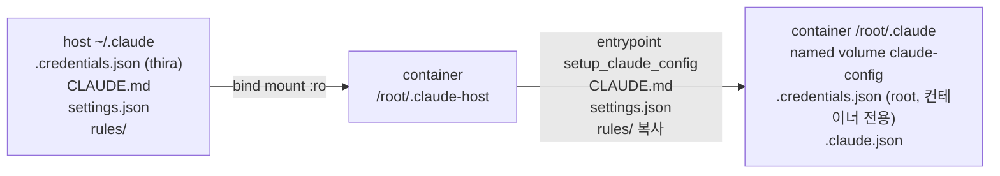

# Claude Code 설정 디렉터리 분리 Implementation Plan

> 작성일: 2026-09-15
> 대상: `docker-compose.yml`, `entrypoint.sh`, `README.md`, `CHANGELOG.md`. 런타임 생성물로 named volume `claude-config`
> 사유: Linux 호스트의 Claude Code 가 주기적으로 로그아웃되어 재로그인을 반복하는 문제를 없애기 위함
> Spec: 없음. 설계 판단이 얇아 plan 단독으로 작성하고 근거는 §0 표에 직접 서술

> 체크박스(`- [ ]`)로 진행을 추적한다. 각 Task는 검증 Step과 커밋 Step으로 끝난다.

**Goal:** 컨테이너의 Claude Code 가 호스트 `~/.claude` 에 어떤 파일도 쓰지 않게 한다. 적용 후 호스트 Claude Code 는 컨테이너가 토큰을 갱신하든 말든 로그인 상태를 유지하고, 컨테이너는 한 번 로그인한 뒤 `reload.sh` 를 거쳐도 로그인 상태와 `.claude.json` 을 유지한다. 호스트의 `CLAUDE.md`, `settings.json`, `rules/` 는 컨테이너 시작 시 복사되어 계속 쓰인다.

**Architecture:** 컨테이너 `/root/.claude` 를 named volume 으로 바꾸고 `CLAUDE_CONFIG_DIR=/root/.claude` 를 명시한다. 호스트 `~/.claude` 는 `/root/.claude-host` 로 읽기 전용 마운트하고, entrypoint 의 `setup_ssh` 와 같은 "마운트 후 복사" 패턴으로 공유 설정 파일만 옮긴다. 인증 파일은 복사하지 않는다.



**Tech Stack:** Docker Compose named volume, POSIX sh(`entrypoint.sh`), Claude Code 2.1.x (`CLAUDE_CONFIG_DIR`, `claude auth login`)

**Note on verification:** 정적 검증(`compose config`, `sh -n`, alpine 컨테이너에서 복사 함수 단독 실행)은 Task 1 안에서 닫힌다. 실제 완료 조건은 Task 3 의 이행 절차 후 (a) 컨테이너 로그인이 volume 에 남고, (b) 컨테이너가 토큰을 갱신한 뒤에도 호스트 `~/.claude/.credentials.json` 이 thira 소유로 유지되는 것이다. (b) 는 access token 수명(8시간)이 지나야 확인 가능하다.

## 0. 확정된 결정

| # | 항목 | 결정 | 근거 |
|---|---|---|---|
| 1 | 원인 | **uid 불일치 + 새 inode 쓰기** | 컨테이너 Claude Code 는 root 로 실행되고, 설정/인증 파일을 새 파일로 만들어 교체한다(`~/.claude/settings.json`, `backups/*` 등이 이미 root 소유). 호스트 Claude Code(2.1.269 바이너리)는 Linux 에서 `EACCES`/`EPERM` 을 "자격증명 없음"과 동일하게 처리한다. 2026-09-15 17:04 호스트 확장 로그 `No authentication found` 직후 17:05 재로그인으로 파일이 thira 소유로 재생성된 것이 관찰된 실패 사례 |
| 2 | 해결 방식 | **설정 디렉터리 분리 (named volume)** | 컨테이너에서 chown 하는 방식은 관찰된 정적 실패는 없애지만, 두 쪽이 동시에 갱신 시각에 활동하면 쓰기와 chown 사이 창에서 호스트 CLI 가 `EACCES` 를 읽고 null 을 캐시(`nn()` 의 `e.value`)한 채 다음 mtime 변화까지 회복하지 못한다. 분리하면 경쟁 자체가 없다. 호스트 인증 파일을 읽기 전용으로 주거나 주기 복사하는 중간안은 refresh token 회전 때문에 성립하지 않는다 |
| 3 | `CLAUDE_CONFIG_DIR` | **`/root/.claude` 로 명시** | 기본값과 같은 경로지만, 명시하면 `.claude.json` 이 이 디렉터리 안에 놓여 volume 에 남는다(호스트의 `~/.claude-work/.claude.json` 으로 실증). 미설정 시 `/root/.claude.json` 은 writable layer 에 있어 recreate 마다 사라진다(현재 컨테이너 `hasCompletedOnboarding` 미설정 상태가 그 결과) |
| 4 | 공유 파일 전달 | **읽기 전용 디렉터리 마운트 + entrypoint 복사** | 파일 단위 bind mount 는 호스트가 파일을 교체(새 inode)하면 stale 이 된다. `setup_ssh` 와 같은 관례. 복사 대상은 `CLAUDE.md`, `settings.json`, `rules/` 로 한정 |
| 5 | volume 이름 | **`name: claude-config`** | `hf-cache` 와 같이 프로젝트 프리픽스 없이 고정해 이행/검증 명령을 안정화 |
| 6 | 기존 컨테이너 데이터 | **이행 절차에서 1회 수동 seed** | `projects/-workspace-*`(세션 기록, 메모리), `plugins/`, `file-history/`, `history.jsonl` 은 호스트 `~/.claude` 에 root 소유로 남아 있고, `.claude.json` 은 현재 컨테이너 writable layer 에만 있다. entrypoint 에 1회성 이행 로직을 넣지 않고 Task 3 의 명령으로 옮긴다 |
| 7 | 버전 | **v1.14.2** | 결함 수정(fix). `docker-compose.so101.yml` plan 이 v1.15.0 을 예약하고 있어 충돌 회피. 볼륨 구성 변경을 patch 로 낸 전례(v1.7.6, v1.11.1) |
| 8 | `Dockerfile` | **변경 없음** | 이미지 재빌드 유발 요인 없음 |

## 0.1 이 계획이 보장하지 않는 것

- 설정 공유는 호스트 -> 컨테이너 단방향이며 컨테이너 시작 시점의 스냅샷이다. 컨테이너 안에서 `/config` 등으로 바꾼 `settings.json` 은 호스트로 돌아가지 않고 다음 시작 때 덮인다.
- Mac 에서도 같은 compose 가 적용되므로 Mac 컨테이너도 최초 1회 로그인이 필요하다. Mac 에는 원래 증상이 없었지만 예외 분기를 두지 않는다.
- 컨테이너를 30일 이상 한 번도 쓰지 않으면 refresh token 이 만료되어 다시 로그인해야 한다. 호스트와 같은 조건이다.
- 호스트 `~/.claude` 에 이미 남아 있는 root 소유 파일은 이 변경이 고치지 않는다. Task 3 의 `chown` 이 필요하다.
- 호스트의 `claude-auth-refresh.timer`(`/usr/local/bin/claude auth refresh`, 경로와 서브커맨드 모두 없음)는 이 문제와 무관한 죽은 장치다. 제거는 Task 3 의 선택 항목이다.

## Global Constraints

- 회귀 정의: (a) `WORKSPACE_PATH`, SSH, study-timer, hf-cache 등 다른 마운트는 그대로여야 한다. (b) 호스트 `~/.claude` 에 대한 쓰기가 컨테이너에서 한 건도 발생하지 않아야 한다(`:ro`). (c) `~/.claude` 가 없는 호스트에서도 entrypoint 가 실패하지 않아야 한다.
- `Dockerfile` 은 수정하지 않는다.
- 커밋은 사용자 요청 시에만 한다. 작업 트리에는 이 계획과 무관한 `entrypoint.sh` 의 미커밋 변경(릴레이 단절 미복구 감지, `RECONNECT_GRACE`)이 함께 있으므로 커밋 시 분리해서 다룬다.

---

### Task 1: compose 와 entrypoint 변경 (§0 결정 2-5)

**Files:**
- Modify: `docker-compose.yml`
- Modify: `entrypoint.sh`

**Interfaces:** named volume `claude-config`, 마운트 경로 `/root/.claude-host`, 함수 `setup_claude_config`

- [x] **Step 1: `docker-compose.yml` 수정**

`environment` 에 `CLAUDE_CONFIG_DIR=/root/.claude` 추가. `~/.claude:/root/.claude` 를 `claude-config:/root/.claude` 와 `~/.claude:/root/.claude-host:ro` 로 교체. top-level `volumes:` 에 `claude-config: { name: claude-config }` 추가.

- [x] **Step 2: `entrypoint.sh` 에 `setup_claude_config` 추가**

`setup_ssh` 뒤에 함수 정의, 본문에서 `setup_ssh` 호출 직후 실행. `/root/.claude-host` 가 없으면 즉시 반환. `CLAUDE.md`, `settings.json` 은 존재할 때만 `cp -f`, `rules/` 는 `rm -rf` 후 `cp -r`.

- [x] **Step 3: 검증 — 정적**

```bash
docker compose config | grep -nE "CLAUDE_CONFIG_DIR|claude-config|claude-host"
sh -n entrypoint.sh
```

기대: 환경변수 1줄, 서비스 볼륨 2줄(`claude-config`, `.claude-host`), top-level volume 1줄. `sh -n` 출력 없음.

- [x] **Step 4: 검증 — 복사 함수 단독 실행**

alpine 컨테이너에 호스트 `~/.claude` 를 `/root/.claude-host:ro`, 빈 임시 디렉터리를 `/root/.claude` 로 마운트하고 함수만 실행한다.

```bash
TMP=$(mktemp -d)
FN=$(sed -n '/^setup_claude_config() {/,/^}/p' entrypoint.sh)
docker run --rm -v "$HOME/.claude":/root/.claude-host:ro -v "$TMP":/root/.claude alpine sh -c "$FN; setup_claude_config; ls -la /root/.claude"
ls "$TMP"/.credentials.json 2>&1   # 존재하지 않아야 함
docker run --rm alpine sh -c "$FN; setup_claude_config; echo rc=\$?"   # 마운트 없을 때 rc=0
rm -rf "$TMP"
```

진행 상황 (2026-09-15): Step 3, 4 통과. `compose config` 에 `CLAUDE_CONFIG_DIR: /root/.claude`, `source: claude-config`, `target: /root/.claude-host`, top-level `name: claude-config` 렌더링 확인. `sh -n`, `dash -n` 출력 없음. alpine 단독 실행에서 `CLAUDE.md`, `settings.json`, `rules/`(8개 파일) 복사되고 호스트 원본과 `cmp`/`diff -r` 동일, `.credentials.json` 미생성, 마운트 없이 실행 시 `rc=0` 이고 `/root/.claude` 미생성.

- [ ] **Step 5: Commit**

```bash
git add docker-compose.yml entrypoint.sh
git commit -m "fix: isolate container claude config from host to stop host logouts"
```

---

### Task 2: 문서 (§0 결정 7)

**Files:**
- Modify: `README.md` (볼륨 구성 표 + 인증 안내)
- Modify: `CHANGELOG.md` (v1.14.2)

- [x] **Step 1: README 볼륨 표의 `~/.claude` 라인을 두 줄로 교체하고, 인증 분리 이유와 최초 로그인 명령을 인용 블록으로 추가**

- [x] **Step 2: CHANGELOG 에 v1.14.2 Fixed / Notes 추가**

- [x] **Step 3: 검증 — `git diff README.md CHANGELOG.md` 로 변경 범위 확인**

- [ ] **Step 4: Commit**

```bash
git add README.md CHANGELOG.md
git commit -m "docs: describe isolated claude config volume and one-time login"
```

---

### Task 3: 이행 절차 (§0 결정 6, 사용자 실행)

`reload.sh` 가 터널을 끊으므로 실행 시점은 사용자가 정한다. 순서를 바꾸면 안 된다: seed 는 `down` 전에 해야 현재 컨테이너의 `.claude.json` 을 가져올 수 있다.

- [ ] **Step 1: volume seed (현재 컨테이너가 살아 있는 상태에서)**

```bash
cd ~/Documents/vscode-tunnel
SEED=$(mktemp -d)
docker cp vscode-tunnel:/root/.claude.json "$SEED/claude.json"
docker volume create claude-config
docker run --rm \
  -v claude-config:/dst \
  -v "$HOME/.claude":/src:ro \
  -v "$SEED":/seed:ro \
  alpine sh -c '
    cp /seed/claude.json /dst/.claude.json &&
    mkdir -p /dst/projects &&
    cp -a /src/projects/-workspace-* /dst/projects/ &&
    cp -a /src/plugins /dst/plugins &&
    cp -a /src/file-history /dst/file-history &&
    cp -a /src/history.jsonl /dst/history.jsonl &&
    chown -R 0:0 /dst &&
    ls -la /dst /dst/projects'
rm -rf "$SEED"
```

기대: `/dst` 에 `.claude.json`, `projects/-workspace-study-physical-ai-study`, `projects/-workspace-study-visual-slam-and-perception-learning`, `plugins`, `file-history`, `history.jsonl`.

- [ ] **Step 2: 컨테이너 재생성**

```bash
./reload.sh
docker compose logs vscode-tunnel 2>&1 | grep "Claude Code 공유 설정 복사"
```

- [ ] **Step 3: 컨테이너 로그인 (1회)**

```bash
docker compose exec vscode-tunnel claude auth login
docker compose exec vscode-tunnel claude auth status
```

기대: `loggedIn: true`, `email: tylee.yeonge@gmail.com`. 터널로 연 VS Code 의 Claude 패널 Sign in 으로 대체 가능.

- [ ] **Step 4: 호스트 정리**

```bash
sudo chown -R "$USER:$USER" ~/.claude
ls -la ~/.claude/.credentials.json ~/.claude/settings.json   # 둘 다 thira 소유
```

선택: 죽은 타이머 제거.

```bash
systemctl --user disable --now claude-auth-refresh.timer
rm ~/.config/systemd/user/claude-auth-refresh.service ~/.config/systemd/user/claude-auth-refresh.timer
systemctl --user daemon-reload
```

선택: 컨테이너 세션 기록이 volume 으로 옮겨진 것을 Step 1 출력으로 확인한 뒤, 호스트에 남은 사본 제거.

```bash
rm -rf ~/.claude/projects/-workspace-*
```

- [ ] **Step 5: 검증 — 이행 완료**

```bash
docker compose exec vscode-tunnel sh -c 'ls -la /root/.claude/.credentials.json /root/.claude/.claude.json; ls /root/.claude/projects'
stat -c '%U %n' ~/.claude/.credentials.json
```

기대: 컨테이너 파일은 root 소유로 volume 안에 존재, 호스트 파일은 thira 소유.

---

## Verification (after all tasks)

- [ ] 컨테이너 access token 만료 시각(로그인 후 8시간)이 지난 뒤 호스트에서 `stat -c '%U' ~/.claude/.credentials.json` 이 여전히 `thira` 이고, 호스트 VS Code 확장 로그에 `No authentication found` 가 새로 찍히지 않는다.
- [ ] `./reload.sh` 를 한 번 더 돌린 뒤 `docker compose exec vscode-tunnel claude auth status` 가 `loggedIn: true` 를 유지한다(volume 보존 확인).
- [ ] 호스트 `~/.claude/settings.json` 을 수정하고 `./reload.sh` 후 컨테이너 `/root/.claude/settings.json` 에 반영된다.

## Self-Review

**Spec coverage:** spec 없음. §0 결정 1-8 은 Task 1(결정 2-5, 8), Task 2(결정 7), Task 3(결정 6) 으로 대응.
**Placeholder scan:** TBD/TODO 없음. 미완 항목은 Task 3 과 Verification 의 체크박스로 추적.
**Type consistency:** volume 이름 `claude-config`, 마운트 경로 `/root/.claude-host`, 함수명 `setup_claude_config` 가 compose, entrypoint, README, CHANGELOG, 이행 명령에서 동일.
