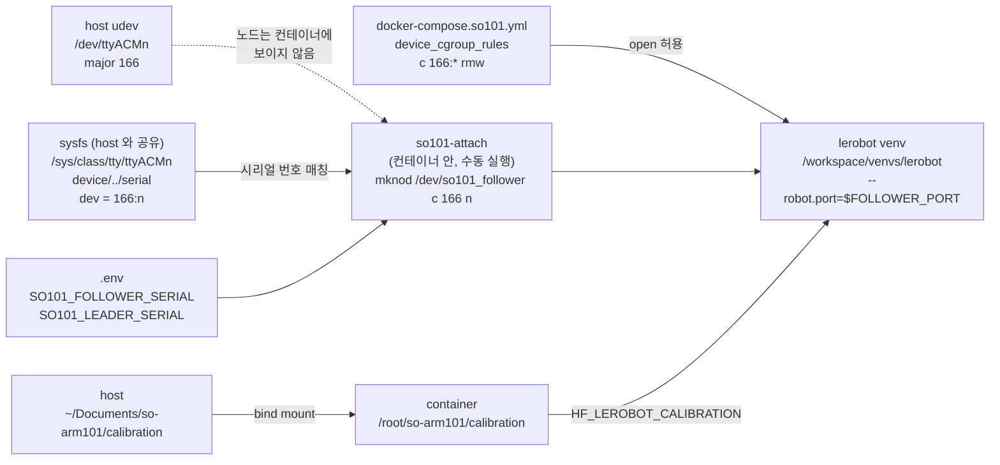

# SO-ARM101 컨테이너 패스스루 Implementation Plan

> 작성일: 2026-09-15
> 대상: `docker-compose.so101.yml`(신규), `so101-attach.sh`(신규), `start.sh`, `reload.sh`, `.env.sample`, `README.md`, `UBUNTU_SETUP.md`, `CHANGELOG.md`, `Dockerfile`(Phase 2, 말미 지원 블록). 런타임 생성물로 컨테이너 안 `/workspace/venvs/lerobot` venv
> 사유: 호스트에서 조립·캘리브레이션을 마친 SO-ARM101 leader/follower 를 vscode-tunnel 컨테이너 안의 lerobot 에서 그대로 쓰기 위함. 팔은 평소에 빼두고 쓸 때만 꽂는 운용을 전제로 한다
> Spec: 없음. 설계 판단이 얇아 plan 단독으로 작성하고 근거는 §0 표에 직접 서술. 참고 문서: `~/Documents/so-arm101/so-arm101-assembly-guide.md` (2.3절 전원, 3.1절 설치, 4.1절 포트 식별, 6.3절 캘리브레이션 파일, 7절 텔레옵 검증)

> 체크박스(`- [ ]`)로 진행을 추적한다. 각 Task는 검증 Step과 커밋 Step으로 끝난다. 커밋 Step은 명령을 준비만 하고, 실행은 사용자가 지시할 때 한다.

**Goal:** `.env` 에 두 서보 보드의 USB 시리얼 번호를 적고 `./start.sh` 를 실행해 두면(이때 팔이 꽂혀 있을 필요 없음), 이후에는 팔을 꽂고 컨테이너 터미널에서 `so101-attach` 한 번으로 `/dev/so101_follower` / `/dev/so101_leader` 노드가 생기고, `FOLLOWER_PORT` / `LEADER_PORT` / `HF_LEROBOT_CALIBRATION` 환경변수와 호스트 캘리브레이션 JSON 이 잡힌 상태에서 `/workspace/venvs/lerobot` 의 lerobot 으로 조립 가이드 7절의 텔레옵 명령이 그대로 동작한다. 팔을 뽑았다 다시 꽂아 `ttyACM` 번호가 바뀌어도 컨테이너 재생성 없이 `so101-attach` 재실행으로 복구된다. 변수가 없는 호스트와 Mac 은 기존 동작과 동일하다.

**Architecture:** 기존 `gpu` / `camera` / `local` / `tailscale` 과 같은 compose 오버레이 분기 패턴을 하나 더 얹는다. 장치는 컨테이너 생성 시점에 노드를 고정하는 `devices:` 대신, `device_cgroup_rules` 로 ttyACM(major 166) 접근 권한만 열어 두고, 컨테이너 안의 짧은 POSIX sh 스크립트가 호스트와 공유되는 sysfs 에서 USB 시리얼 번호로 보드를 찾아 `mknod` 로 노드를 만든다. 스크립트는 리포 파일을 bind mount 해 이미지를 건드리지 않는다. lerobot 은 bind mount 된 `/workspace/venvs` 아래 시스템 Python 3.12 venv 에 설치한다. `Dockerfile`, `docker-compose.yml`, `entrypoint.sh` 는 변경하지 않는다.



**Tech Stack:** Docker 29.2.1, Docker Compose v5.0.2, POSIX sh(`start.sh` / `reload.sh` / `so101-attach.sh`), Linux sysfs + `mknod`(CAP_MKNOD, Docker 기본 capability), Ubuntu 24.04 시스템 Python 3.12.3 venv, lerobot 커밋 `b6ec0060`(v0.6.1-61, extras `core_scripts,feetech`), feetech-servo-sdk 1.0.0, pyserial 3.5

**Note on verification:** 텔레옵(조립 가이드 7절 검증 항목)까지 확인해야 완료다. 2026-09-15 현재 팔이 빠져 있어 Task 1-3 의 검증은 정적 검증(`compose config`, `sh -n`, 스크립트 단독 실행, 감지 로직 단독 실행)까지 가능하고, 이 설계는 팔 없이 컨테이너를 만들어도 되므로 Verification V1-V2 도 팔 없이 진행할 수 있다. V3 이후는 팔을 연결한 뒤 수행한다.

## 0. 확정된 결정

| # | 항목 | 결정 | 근거 |
|---|---|---|---|
| 1 | 장치 접근 방식 | **`device_cgroup_rules: "c 166:* rmw"` + 컨테이너 안 `so101-attach`(sysfs 시리얼 매칭 후 `mknod`)** | 팔을 평소에 빼두므로 컨테이너 생성 시점에 노드를 고정하는 `devices:` 는 매 사용마다 `./reload.sh`(터널·세션·프로세스 전부 단절)를 요구해 부적합. 대안은 이 컨테이너에서 실증(§0.2): sysfs 가 보이고 `device/../serial` 로 USB 시리얼을 읽을 수 있음, `mknod` 가 동작함, cgroup 규칙이 있으면 만든 노드가 열리고 없으면 `Operation not permitted`. `privileged` 와 `/dev:/dev` bind 는 Docker 기본 `/dev/pts`, `/dev/shm` 마운트를 밀어내 `shm_size: 8gb` 를 무력화하므로 비채택 |
| 2 | 컨테이너 내부 노드 이름 | **`/dev/so101_follower`, `/dev/so101_leader`** | 호스트 `ttyACM` 번호와 무관하게 역할이 이름에 드러남. pyserial / feetech-servo-sdk 는 경로 문자열을 `open` 만 하고 lerobot `motors_bus.py` 에 포트명 검증이 없음. `lerobot-find-port` 는 `/dev/ttyACM*` glob 이라 컨테이너에서 이 노드를 못 찾지만, 포트가 환경변수로 고정되고 `so101-attach` 자체가 포트 식별 역할을 하므로 필요 없음 |
| 3 | 보드 식별 키 | **USB 시리얼 번호만** — `.env` 의 `SO101_FOLLOWER_SERIAL` / `SO101_LEADER_SERIAL` | sysfs 의 `serial` 속성과 문자열 그대로 비교할 수 있어 by-id 경로에서 파싱할 필요가 없음. 값은 머신 고유라 README "머신별 오버라이드 패턴"의 `TAILSCALE_IP` 축과 같은 "파일은 commit, 값은 gitignored" 방식. **이 문서, README, CHANGELOG 어디에도 실제 값을 적지 않는다** |
| 4 | 오버레이 감지 조건 | **`.env` 에 두 변수의 활성 라인이 모두 있을 때** (노드 존재 무관) | 노드는 나중에 `so101-attach` 가 만들므로 컨테이너 생성 시 팔이 없어도 된다. `TAILSCALE_IP` 감지와 같은 `grep -qE` 패턴을 재사용 |
| 5 | 스크립트 배치 | **리포의 `so101-attach.sh` 를 `/usr/local/bin/so101-attach:ro` 로 bind mount** | `Dockerfile` 무변경(재빌드 없음). `docker-compose.tailscale.yml` 이 `./study-timer-nginx.conf` 를 같은 방식으로 마운트하는 선례가 있음. `entrypoint.sh` 에 넣는 방법은 미커밋 변경과 충돌하고 재실행이 불편해 비채택 |
| 6 | attach 실행 시점 | **수동** — 팔을 꽂은 뒤 컨테이너 터미널에서 `so101-attach` (호스트에서는 `docker exec vscode-tunnel so101-attach`) | 팔이 보통 빠져 있어 컨테이너 시작 시 자동 실행(오버레이 `command:` 오버라이드)은 실익이 적음. 호스트 udev `RUN+=` 로 `docker exec` 를 거는 자동화는 호스트 측 부품이 늘어 후속 과제로 미룸 |
| 7 | lerobot 설치 위치 | **`/workspace/venvs/lerobot`, 시스템 `python3 -m venv`** — 이미지 밖 | lerobot 은 `numpy>=2.0,<2.3` 을 요구하는데 이미지 시스템 Python 의 `cv2` 는 소스 빌드 4.10 이 numpy 1.26.4 에 링크된 상태라 시스템에 설치하면 `cv2` 가 깨진다. torch 포함 수 GB 를 13.7GB 이미지에 더하지 않는다. `/workspace` 는 bind mount 라 recreate 후에도 남고 이미 `/workspace/venvs/remerge` 관례가 있다. uv 관리 Python(`/root/.local/share/uv`)은 writable layer 에 있어 recreate 후 venv 가 깨지므로(현재 `remerge` venv 가 그 상태이고 `uv` 도 컨테이너에 없음) 이미지에 들어 있는 시스템 Python 3.12.3 을 쓴다. `python3.12-venv` 는 이미지에 없어 venv 를 만드는 시점에만 컨테이너 안에서 apt 설치하며(writable layer), 만들어진 venv 는 `/usr/bin/python3.12` 심볼릭 링크라 재생성 후에도 동작한다 |
| 8 | lerobot 버전 | **호스트 `~/lerobot` 체크아웃과 같은 커밋 `b6ec0060779550c0a157ae34feb89e0cf86012a8` 으로 git 핀**, extras `core_scripts,feetech` | 호스트 conda 환경(`lerobot 0.6.2 editable`)과 같은 코드라 캘리브레이션 JSON 포맷과 CLI 인자가 호환. extras 는 조립 가이드 3.1절과 동일 |
| 9 | 캘리브레이션 공유 | **`~/Documents/so-arm101/calibration` bind mount -> `/root/so-arm101/calibration` + `HF_LEROBOT_CALIBRATION`** | 조립 가이드 6.3절이 정한 위치이자 호스트 bashrc 와 같은 변수명. lerobot 은 `HF_LEROBOT_CALIBRATION / "robots" / "so_follower" / "<id>.json"` 으로 읽으므로(`robots/robot.py:49-53`) 기존 구조 그대로 쓸 수 있다. 기본 경로(`$HF_HOME/lerobot/calibration`, hf-cache named volume 안) 위에 중첩 bind 하는 방식은 설명이 어려워 비채택 |
| 10 | 포트 환경변수 | **compose `environment` 로 `FOLLOWER_PORT` / `LEADER_PORT` 고정** | VS Code 터미널과 tasks 가 컨테이너 env 를 상속하므로 bashrc 의존이 없다(가이드 6.3절의 "bashrc 를 타지 않는 실행 경로" 경고 회피). 변수명은 가이드 4.1절과 동일 |
| 11 | `group_add` | **미사용** | 컨테이너 프로세스는 root 이고 `mknod` 로 만든 노드는 `root:root` 라 접근 가능. 카메라 오버레이의 `group_add: video` 는 비-root 대비 선제 조치였고 여기서는 불필요 |
| 12 | `lerobot-record` 데이터셋 위치 | **이번 범위 밖** (§0.1) | 기본값 `HF_LEROBOT_HOME=$HF_HOME/lerobot` 은 hf-cache named volume 안이라 호스트에서 바로 볼 수 없고, 가이드 6.3절의 "재생성 불가 데이터는 `~/.cache` 밖" 원칙과도 어긋난다. `HF_LEROBOT_HOME` 을 오버레이에 둘지 `--dataset.root` 로 매 명령 지정할지는 후속에서 결정 |
| 13 | `Dockerfile` / `docker-compose.yml` / `entrypoint.sh` | **`Dockerfile` 은 말미의 SO-ARM101 지원 블록만 추가(Phase 2), 나머지 둘은 변경 없음** | 결정 16, 17 의 alias 와 런타임 패키지는 이미지에 있어야 recreate 후에도 유지된다. 블록을 `ENV HF_HOME` 뒤, `WORKDIR` 앞에 두어 OpenCV 빌드·ROS 등 상위 레이어 캐시는 무효화하지 않는다 |
| 14 | 버전 | **v1.15.0** | 새 오버레이 + 스크립트 변경 = feat(minor). 카메라 오버레이가 v1.12.0 이었던 것과 같은 급 |
| 15 | 커밋 | **사용자가 직접 지시할 때 실행** | 각 Task 의 Commit Step 은 파일 목록과 메시지만 준비. 계획 문서 자체의 커밋 여부도 사용자가 정한다 |
| 16 | 편의 alias (Phase 2) | **`Dockerfile` 이 `/root/.bashrc` 에 `acl`(venv 활성화)과 `so101-teleop`(가이드 7절 텔레옵) alias, `so101-help`(명령 요약 출력 셸 함수, README 빠른 참조와 동일 내용)를 heredoc 으로 추가** | 사용자 요청. venv 는 이미지 밖이라 정의만 이미지에 둔다. `acl` 은 호스트 bashrc 의 `alias acl="conda activate lerobot"` 과 같은 이름. ROS 블록이 `/root/.bashrc` 에 `source` 를 추가하는 선례를 따른다. `RUN cat >> ... <<'EOF'` heredoc 은 이 데몬(Docker 29, BuildKit)에서 소형 빌드로 동작과 `$` 보존을 확인했다 |
| 17 | lerobot 런타임 패키지 (Phase 2) | **`python3-venv`, `libavdevice60`, `libavfilter9` 를 같은 블록에서 apt 설치** | Phase 1 V4 에서 이미지에 `python3.12-venv` 가 없어 venv 생성이 실패했고, torchcodec 이 `libavdevice.so.60` / `libavfilter.so.9` 부재로 로드 실패해 pyav 폴백으로 동작했다. 이미지를 어차피 다시 빌드하므로 함께 넣어 README 의 apt 수동 단계와 pyav 폴백 한계를 없앤다 |
| 18 | 카메라 패스스루 방식 (Phase 2) | **보드와 같은 attach 방식 확장** — `device_cgroup_rules` 에 `c 81:* rmw` 추가, `so101-attach` 가 sysfs `/sys/class/video4linux` 에서 식별값(결정 22: USB 시리얼 또는 USB 인터페이스 경로)과 `index == 0`(캡처 노드)으로 찾아 `/dev/so101_cam_wrist`, `/dev/so101_cam_overview` 를 `mknod` | 손목 카메라는 팔에 달려 팔과 함께 빼고 꽂으므로 `devices:` 고정 매핑은 결정 1 과 같은 이유로 부적합. 웹캠은 USB 시리얼이 고유하지 않은 경우가 많아(ELP 의 시리얼은 `01.00.00`) 포트 경로로 식별하고 "같은 포트에 꽂는다"를 전제한다. UVC 카메라는 캡처(index 0)와 메타데이터(index 1) 노드 2개가 생기므로 index 0 만 잡는다. 임의 이름 노드를 cv2(`CAP_V4L2`, `CAP_ANY`)와 lerobot `OpenCVCamera` 가 그대로 여는 것을 ELP 로 실증했다(§0.2). 카메라 변수는 선택이며 비어 있으면 건너뛴다 |
| 19 | 카메라 역할 (Phase 2) | **손목 = Realtek "USB Camera"(`0bda:5844`, 새로 연결), 전체 뷰 = ELP 3D Global Shutter 스테레오(`32e4:9282`, 기존 연결)** | 새 카메라의 프레임에 보라색 그리퍼 조가 근접으로 잡혀 손목 카메라로 판정. 사용자가 ELP 는 이미 연결되어 있던 전체 뷰 카메라라고 확인. ELP 는 기존 `docker-compose.camera.yml` 의 `/dev/video0`, `/dev/video1` 매핑도 그대로 유지되어 두 이름으로 보인다(같은 장치를 두 프로세스가 동시에 열지 않는 것은 사용자 책임) |
| 20 | lerobot 카메라 설정 권장값 (Phase 2) | **손목 640x480 @ 30fps MJPG, 전체 뷰 1280x480 @ 60fps MJPG** (README 에 `--robot.cameras` 예시로 기재) | `v4l2-ctl --list-formats-ext` 결과: Realtek 은 MJPG 640x480/848x480/960x540/1280x720 모두 30fps, ELP 는 MJPG 1280x480(좌우 640x480 병치) 5/10/15/25/60/120fps 로 30fps 가 없다. lerobot 이 요청 fps 를 실제 값과 대조하므로 카메라가 지원하는 값만 쓴다. 조립 가이드 7절 권고(MJPG, 허브 없이 직결)와 일치 |
| 21 | 장치 조회 (Phase 2) | **`so101-attach list` 부명령** — 보드(시리얼)와 카메라(시리얼, USB 경로, 이름)를 `.env` 에 적을 값으로 출력 | `lerobot-find-port` / `lerobot-find-cameras` 는 `/dev/ttyACM*`, `/dev/video*` glob 이라 컨테이너에서 쓸 수 없다. 호스트의 `/dev/v4l/by-path` 표기(`usb-0:7.1:1.0`)는 sysfs 인터페이스명(`1-7.1:1.0`)과 형식이 달라 혼동을 부르므로 스크립트가 직접 sysfs 값을 보여 준다 |
| 22 | 카메라 식별값 (Phase 2 후속, v1.16.0) | **`SO101_CAM_WRIST_ID` / `SO101_CAM_OVERVIEW_ID` 하나에 USB 시리얼 번호 또는 USB 인터페이스 경로를 넣고, 스크립트는 두 속성 중 어느 쪽과 같아도 매칭** | 사용자 요청(팔처럼 포트가 바뀌어도 인식). 이 환경의 두 카메라는 모델이 달라 시리얼(`200901010001`, `01.00.00`)로 구분되므로 포트를 바꿔도 잡힌다. 웹캠 시리얼은 모델 공통값이라 같은 모델 2대면 구분이 안 되므로 경로 매칭을 남겨 그 경우만 포트 고정으로 처리한다. 형식 판별 없이 두 값과 단순 비교해 로직을 최소화 |

## 0.1 이 계획이 보장하지 않는 것

- 팔을 꽂은 뒤 `so101-attach` 를 실행하기 전에는 노드가 없거나 이전 값으로 남아 있다. 자동 감지·자동 실행은 없다(결정 6).
- 팔을 뽑은 뒤에도 노드가 남는다. 열면 실패하고, 다음 `so101-attach` 가 정리한다.
- follower 만 꽂으면 follower 노드만 만들어지고 leader 항목 실패로 종료 코드는 1 이다. 텔레옵은 두 팔이 다 필요하지만 follower 단독 사용을 막지는 않는다.
- Mac(Docker Desktop) 은 USB 시리얼 패스스루 자체를 지원하지 않는다. 변수 미설정으로 오버레이가 적용되지 않아 기존 동작과 같을 뿐, Mac 에서 팔을 쓰는 방법은 제공하지 않는다.
- venv 는 이미지 밖이라 이미지 재현성 대상이 아니다. lerobot 커밋 핀은 README 절차에 기록되지만 자동으로 강제되지 않는다.
- 카메라를 USB 인터페이스 경로로 식별한 경우(같은 모델 2대)에만 다른 포트에 꽂으면 `so101-attach list` 로 값을 다시 확인해 `.env` 를 바꾸고 recreate 해야 한다. 시리얼로 식별하면 포트 무관이지만 같은 시리얼(같은 모델)이 2대 보이면 먼저 발견된 쪽이 잡힌다. 카메라 노드도 attach 시점 스냅샷이라 뽑은 뒤 남고, 다음 attach 가 정리한다.
- 같은 ELP 장치가 카메라 오버레이의 `/dev/video0`(+`/dev/video1`)과 so101 의 `/dev/so101_cam_overview` 두 이름으로 보인다. 두 이름을 동시에 열면 V4L2 스트리밍이 충돌한다. 이 계획은 그것을 막지 않는다.
- lerobot 의 `--display_data`(rerun 뷰어)와 `lerobot-record` 실행은 검증 범위 밖이다. 카메라는 lerobot `OpenCVCamera` 로 프레임을 읽는 것까지 확인한다.
- 컨테이너가 `lerobot-calibrate` 로 캘리브레이션을 새로 쓰면 호스트 파일이 root 소유가 된다.
- `lerobot-record` 의 데이터셋 저장 위치는 다루지 않는다(결정 12). 기본값은 hf-cache named volume 안이다.
- `lerobot-record` 의 키보드 조작은 컨테이너에 `DISPLAY` 가 없어 lerobot 이 pynput 대신 stdin 으로 동작한다(`keyboard_input.py` 의 `is_headless()`). TTY 가 있는 VS Code 터미널이나 `docker exec -it` 에서만 키 입력을 받고, 백그라운드 실행에서는 받지 못한다. 이 계획은 record 를 검증 범위에 넣지 않는다.
- 호스트 conda 환경의 lerobot 과 컨테이너 lerobot 을 같은 포트에 동시에 붙이면 패킷이 섞인다. 시리얼 포트에 배타 잠금이 없고 이 계획은 그것을 막지 않는다.
- `.env` 는 `env_file` 로 컨테이너에 주입되므로 변수(보드 시리얼, 카메라 경로)를 추가·변경할 때마다 다음 `./start.sh` 에서 컨테이너가 1회 재생성된다(터널 잠시 단절). 이후 장치를 꽂고 뽑는 동작에서는 재생성이 없다.

## 0.2 근거가 된 현재 상태 (2026-09-15 확인)

호스트:

| 항목 | 값 |
|---|---|
| 서보 보드 | Waveshare Bus Servo Adapter, CH343 USB-Serial(`1a86:55d3`), `cdc_acm` 드라이버로 `/dev/ttyACM0`, `/dev/ttyACM1` (2026-09-13 커널 로그). 시리얼 번호는 호스트 bashrc 의 `FOLLOWER_PORT` / `LEADER_PORT` 경로(`/dev/serial/by-id/usb-1a86_USB_Single_Serial_<시리얼>-if00`)에 들어 있음 |
| 캘리브레이션 | `~/Documents/so-arm101/calibration/robots/so_follower/so101_follower_01.json`, `teleoperators/so_leader/so101_leader_01.json`. `~/.cache/huggingface/lerobot/calibration/` 은 비어 있음(이동 완료) |
| lerobot | `~/lerobot` 커밋 `b6ec0060`(v0.6.1-61), conda env `lerobot` Python 3.12.14, torch 2.11.0, feetech-servo-sdk 1.0.0, pyserial 3.5 |
| udev 규칙 | SO-101 관련 없음. by-id 는 커널/udev 기본 생성 |
| 현재 연결 | 팔 미연결(`/dev/ttyACM*`, `/dev/serial/by-id/` 부재). 평소 운용 상태 |

컨테이너(`vscode-tunnel`):

| 항목 | 값 |
|---|---|
| 베이스 | `nvidia/cuda:12.6.3-cudnn-devel-ubuntu24.04`, 이미지 13.7GB, root 실행, CapEff `a80425fb`(Docker 기본, `CAP_MKNOD` 포함) |
| Python | 시스템 3.12.3. 이미지에 `python3.12-venv` 없음(이전 컨테이너의 것은 writable layer 수동 설치분으로 22:58 재생성 때 소실). venv 생성 시 컨테이너 안에서 apt 설치 필요 |
| `cv2` | `/usr/local/lib/python3.12/dist-packages/cv2` 4.10.0(소스 빌드), numpy 1.26.4 |
| torch | 시스템 Python 에 없음 |
| venv 관례 | `/workspace/venvs/remerge`(uv 0.12.4, Python 3.11, torch 포함). `uv` 바이너리와 uv Python 은 현재 컨테이너에 없음 |
| 장치 | `/dev/video0`, `/dev/video1` (카메라 오버레이). `dialout` gid 20, `video` gid 44 존재 |
| sysfs | `/sys/class/tty` 에 98개 항목 보임. `/sys/class/video4linux/video0/device/../serial` 로 USB 시리얼, `dev` 로 `81:0` 을 읽을 수 있음(ttyACM 도 같은 구조) |
| env | `.env` 의 `TAILSCALE_IP`, `DATASETS_PATH`, `BASE_IMAGE` 등이 `env_file` 로 컨테이너 env 에 주입되어 있음 |
| libav | `libavcodec.so.60`, `libavformat.so.60`, `libswscale.so.7`, `libavutil.so.58`, `libswresample.so.4`(FFmpeg 6.1, OpenCV 빌드 의존성) 존재. `libavdevice.so.60`, `libavfilter.so.9` 없음 -> torchcodec 로드 실패, lerobot 은 pyav 폴백 |
| 워크스페이스 | `WORKSPACE_PATH=/home/thira/Documents/vscode-tunnel-workspace` -> `/workspace` |

카메라(2026-09-15 23:30 확인, Phase 2):

| 항목 | 값 |
|---|---|
| 손목 카메라 | Realtek "USB Camera"(`0bda:5844`), 23:27 에 새로 연결됨(커널 로그에 이 장치만 추가). 루트 포트 7 의 허브 아래. 노드 2개(index 0 캡처, index 1 메타데이터). 기본 640x480 @ 30 YUYV. MJPG 640x480 / 848x480 / 960x540 / 1280x720 모두 30fps. 캡처 프레임에 보라색 그리퍼 조가 근접으로 보임 |
| 전체 뷰 카메라 | ELP "3D Global Shutter Camera"(`32e4:9282`) 스테레오, 9월 13일부터 연결. 노드 2개(index 0/1, 하나의 USB 인터페이스). 기본 640x240 @ 25 YUYV(좌우 병치). MJPG 640x240 / 1280x480 / 1600x600 / 2560x720 / 2560x800, fps 5/10/15/25/60/120(640x240 은 150/210 포함), 30fps 없음. 캡처 프레임은 방 전체(좌우 흑백 병치) |
| USB 시리얼 | Realtek `200901010001`, ELP `01.00.00` — 모델 공통값으로 보여 고유 식별자로 쓰지 않는다 |
| 임의 이름 노드 실증 | 컨테이너에서 `/dev/so101_cam_test`(81:0) 를 만들어 venv 의 cv2(`CAP_V4L2`, `CAP_ANY` 모두 V4L2 백엔드로 open)와 lerobot `OpenCVCamera(index_or_path=Path(...))` 로 640x240 프레임 수신. `lerobot-find-cameras` 는 `/dev/video*` glob 이라 이 노드를 못 본다 |
| 호스트 도구 | `v4l2-ctl` 있음(`/usr/bin/v4l2-ctl`) |

Docker 동작 실증:

```bash
# 1) 실행 중 컨테이너에서 mknod 동작
docker exec vscode-tunnel sh -c 'mknod /tmp/t c 1 3 && ls -l /tmp/t && rm /tmp/t'
# crw-r--r-- 1 root root 1, 3 /tmp/t

# 2) cgroup 규칙 유무에 따른 open 결과 (video0 = 81:0 을 대상으로)
docker run --rm --device-cgroup-rule='c 81:* rmw' nginx:alpine \
  sh -c 'mknod /dev/v0 c 81 0 && exec 3</dev/v0 && echo open-ok'      # open-ok
docker run --rm nginx:alpine \
  sh -c 'mknod /dev/v0 c 81 0 && exec 3</dev/v0 && echo open-ok'      # Operation not permitted

# 3) compose 가 device_cgroup_rules 를 렌더링
docker compose -f docker-compose.yml -f <overlay> config | grep -A1 device_cgroup_rules
#     device_cgroup_rules:
#       - c 166:* rmw
```

## Global Constraints

- 회귀 정의: (a) `.env` 에 SO101 변수가 없는 호스트(Mac 포함)에서 `./start.sh` / `./reload.sh` 의 `COMPOSE_ARGS` 가 이전과 동일해야 한다. (b) 변수가 있고 팔이 빠진 상태에서 `./start.sh` 가 성공하고, `so101-attach` 는 노드를 만들지 않은 채 종료 코드 1 과 `not found` 메시지로 끝나야 한다. (c) 기존 카메라 오버레이(`/dev/video0`, `/dev/video1`)와 공존해야 한다.
- `docker-compose.yml`, `entrypoint.sh` 는 수정하지 않는다. `Dockerfile` 은 `ENV HF_HOME` 뒤, `WORKDIR /workspace` 앞에 SO-ARM101 지원 블록(apt 3개 + alias heredoc)만 추가하고 그 위 레이어(OpenCV 빌드, ROS 등)는 건드리지 않는다.
- `entrypoint.sh` 에는 이 작업과 무관한 미커밋 변경(릴레이 단절 미복구 감지, `RECONNECT_GRACE`)이 있다. 모든 커밋은 `git add <파일>` 로 파일 단위로 스테이징하고 `entrypoint.sh` 를 섞지 않는다. `.Dockerfile.swp`(vim 스왑 잔재)도 스테이징하지 않는다.
- 커밋과 태그는 사용자가 지시할 때만 실행한다. Commit Step 의 명령은 그때 쓸 준비물이다.
- `.env` 는 gitignored 이며 커밋하지 않는다. 시리얼 번호는 `.env` 에만 존재하고, 이 문서·`.env.sample`·README·CHANGELOG·UBUNTU_SETUP 에는 자리표시자(`XXXXXXXXXX` / `YYYYYYYYYY`)만 쓴다.
- `so101-attach.sh` 는 컨테이너의 `/bin/sh`(dash)와 busybox sh 에서 모두 돌아야 하므로 POSIX sh 만 쓴다(bash 배열, `[[ ]]`, 프로세스 치환 금지). 실행 비트(`chmod +x`)를 켠다. bind mount 는 호스트 파일 모드를 그대로 쓰므로 실행 비트가 없으면 컨테이너에서 실행되지 않는다.
- `start.sh` 와 `reload.sh` 에는 같은 감지 블록을 동일하게 넣는다(`reload.sh` 주석 규약 "새 오버레이가 늘면 양쪽 모두 갱신할 것").
- README 파일 구성 트리는 기존에 유니코드 박스 문자(`├──`)를 쓰고 있다. 줄을 추가할 때 기존 문자를 그대로 따르고, 트리 전체를 ASCII 로 바꾸는 작업은 범위 밖이다.
- `UBUNTU_SETUP.md` 3-6 감지 목록에 카메라 오버레이가 빠져 있는 것은 기존 상태다. 이 작업은 SO-ARM101 항목만 추가하고 카메라 항목은 건드리지 않는다(언급만).
- 하지 않는 것: 호스트 udev 자동화, 컨테이너 시작 시 자동 attach, 데이터셋 위치 설정, venv 자동 생성(entrypoint), 단일 팔 전용 모드.

---

## Phase 1: 서보 보드 패스스루와 lerobot venv (완료, 실기 V5-V6 대기)

### Task 1: compose 오버레이, attach 스크립트, `.env` 설정 (§0 결정 1-6, 9-11)

**Files:**
- Create: `docker-compose.so101.yml`
- Create: `so101-attach.sh` (실행 비트)
- Modify: `.env.sample`
- Modify (gitignored, 커밋 대상 아님): `.env`

**Interfaces:** `.env` 변수 `SO101_FOLLOWER_SERIAL`, `SO101_LEADER_SERIAL`(Task 2 감지 로직과 `so101-attach` 가 읽음). 컨테이너 명령 `so101-attach`(exit 0 = 두 노드 생성, exit 1 = 하나 이상 미발견). 컨테이너 경로 `/dev/so101_follower`, `/dev/so101_leader`, `/root/so-arm101/calibration`. 컨테이너 환경변수 `FOLLOWER_PORT`, `LEADER_PORT`, `HF_LEROBOT_CALIBRATION`(Task 3 문서와 Verification 이 인용). 출력 메시지 접두어 `[so101-attach]`.

- [x] **Step 1: `docker-compose.so101.yml` 작성**

```yaml
services:
  vscode-tunnel:
    # SO-ARM101 (LeRobot) leader/follower 서보 보드 패스스루.
    # 보드는 Waveshare Bus Servo Adapter(CH343 USB-Serial, 1a86:55d3)로, 호스트에서
    # cdc_acm 이 /dev/ttyACM* (major 166) 로 잡는다. 팔은 평소에 빼두고 쓸 때만 꽂으므로
    # 컨테이너 생성 시점에 노드를 고정하는 devices: 매핑은 쓸 수 없다. 대신
    #   1) 여기서 major 166 전체에 cgroup 접근 권한만 열어 두고,
    #   2) 팔을 꽂은 뒤 컨테이너 안에서 so101-attach 를 실행해, 호스트와 공유되는
    #      sysfs(핫플러그 실시간 반영)에서 USB 시리얼 번호로 보드를 찾아 mknod 로 노드를 만든다.
    # mknod 에 필요한 CAP_MKNOD 는 Docker 기본 capability 에 포함된다.
    # 노드는 root:root 로 생성되고 컨테이너 프로세스가 root 라 group_add 불필요.
    device_cgroup_rules:
      - "c 166:* rmw"
    environment:
      # so101-attach 가 sysfs 에서 찾을 USB 시리얼 번호 (.env, 머신 고유 값)
      - SO101_FOLLOWER_SERIAL=${SO101_FOLLOWER_SERIAL}
      - SO101_LEADER_SERIAL=${SO101_LEADER_SERIAL}
      # so101-attach 가 만드는 노드 경로. lerobot CLI 의 --robot.port / --teleop.port 에 넣는다.
      # 변수명은 조립 가이드 4.1절(호스트 bashrc)과 같게 맞춰 같은 명령을 그대로 쓴다.
      - FOLLOWER_PORT=/dev/so101_follower
      - LEADER_PORT=/dev/so101_leader
      # 캘리브레이션 JSON 위치. 미설정 시 lerobot 이 $HF_HOME/lerobot/calibration
      # (hf-cache 볼륨 안)로 돌아가 파일이 두 벌로 갈라지므로 명시 고정한다.
      - HF_LEROBOT_CALIBRATION=/root/so-arm101/calibration
    volumes:
      # 노드 생성 스크립트. 이미지에 넣지 않고 리포 파일을 바로 마운트한다
      # (docker-compose.tailscale.yml 의 study-timer-nginx.conf 와 같은 방식).
      - ./so101-attach.sh:/usr/local/bin/so101-attach:ro
      # 호스트에서 만든 캘리브레이션 공유 (조립 가이드 6.3절 위치).
      # 하위 구조 robots/so_follower/<id>.json, teleoperators/so_leader/<id>.json 그대로 사용.
      - ~/Documents/so-arm101/calibration:/root/so-arm101/calibration
```

- [x] **Step 2: `so101-attach.sh` 작성**

```sh
#!/bin/sh
# SO-ARM101 서보 보드 노드를 컨테이너 /dev 에 생성한다. 팔의 USB 를 꽂은 뒤 실행.
#
# 컨테이너 /dev 는 tmpfs 라 호스트 udev 가 만든 /dev/ttyACM* 노드가 보이지 않는다.
# 대신 호스트와 공유되는 sysfs 에서 USB 시리얼 번호로 보드를 찾아 major:minor 를 읽고
# mknod 로 /dev/so101_follower, /dev/so101_leader 를 만든다. 접근 권한은
# docker-compose.so101.yml 의 device_cgroup_rules (c 166:*) 가 열어 둔다.
# 다시 꽂아 ttyACM 번호가 바뀌어도 재실행하면 노드를 새 번호로 갈아 끼운다.
# 보드가 안 보이면 남아 있던 노드를 지우고 실패(exit 1)한다.
# 시리얼 번호는 .env 의 SO101_FOLLOWER_SERIAL / SO101_LEADER_SERIAL 로 컨테이너 env 에 들어온다.

# attach <노드 이름> <USB 시리얼 번호>
attach() {
    name=$1
    serial=$2
    for tty in /sys/class/tty/ttyACM*; do
        [ -e "$tty" ] || continue
        # /sys/class/tty/ttyACMn/device 는 USB 인터페이스(예: 1-6.1:1.0)이고
        # 그 부모(1-6.1)가 USB 장치라 serial 속성을 가진다.
        [ "$(cat "$tty/device/../serial" 2>/dev/null)" = "$serial" ] || continue
        devnum=$(cat "$tty/dev")    # 예: 166:0
        rm -f "/dev/$name"
        mknod "/dev/$name" c "${devnum%%:*}" "${devnum##*:}"
        echo "[so101-attach] /dev/$name -> $(basename "$tty") ($devnum, serial $serial)"
        return 0
    done
    rm -f "/dev/$name"
    echo "[so101-attach] serial $serial not found in /sys/class/tty (USB unplugged?)" >&2
    return 1
}

: "${SO101_FOLLOWER_SERIAL:?SO101_FOLLOWER_SERIAL is not set (.env)}"
: "${SO101_LEADER_SERIAL:?SO101_LEADER_SERIAL is not set (.env)}"

rc=0
attach so101_follower "$SO101_FOLLOWER_SERIAL" || rc=1
attach so101_leader "$SO101_LEADER_SERIAL" || rc=1
exit $rc
```

```bash
chmod +x so101-attach.sh
```

- [x] **Step 3: `.env.sample` 에 안내 주석 추가**

파일 끝(`# TAILSCALE_IP=100.x.y.z` 다음)에 추가:

```env

# SO-ARM101 (LeRobot) 서보 보드 패스스루 (선택, Linux 전용)
# 두 값이 모두 설정되면 start.sh / reload.sh 가 -f docker-compose.so101.yml 을 자동으로 얹어
# ttyACM 접근 권한을 열고 FOLLOWER_PORT / LEADER_PORT 환경변수를 잡는다. 컨테이너 생성 시
# 팔이 꽂혀 있을 필요는 없다. 팔을 꽂은 뒤 컨테이너 안에서 `so101-attach` 를 실행하면
# /dev/so101_follower, /dev/so101_leader 노드가 생긴다.
# 값: Waveshare 보드(CH343) 의 USB 시리얼 번호. 팔 2대의 USB 를 꽂고 아래로 확인.
#   ls -l /dev/serial/by-id/
#   # usb-1a86_USB_Single_Serial_XXXXXXXXXX-if00 -> ../../ttyACM0   <- Serial_ 뒤 10자리
# 어느 쪽이 follower 인지는 한쪽 USB 를 뽑았을 때 사라지는 항목으로 판별 (조립 가이드 4.1절).
# 따옴표 없이 적을 것.
# SO101_FOLLOWER_SERIAL=XXXXXXXXXX
# SO101_LEADER_SERIAL=YYYYYYYYYY
```

- [x] **Step 4: 이 머신의 `.env` 에 실제 값 추가 (커밋 금지)**

호스트 bashrc 의 `FOLLOWER_PORT` / `LEADER_PORT` 경로에서 `Serial_` 뒤 10자리를 옮겨 적는다. 값은 이 문서에 남기지 않는다.

진행 상황 (2026-09-15): bashrc 값으로 입력 완료. 값은 `.env` 에만 존재.

```env

# SO-ARM101 서보 보드 USB 시리얼 (follower / leader)
SO101_FOLLOWER_SERIAL=<follower 10자리>
SO101_LEADER_SERIAL=<leader 10자리>
```

- [x] **Step 5: 검증 — 문법, compose 렌더링, 스크립트 단독 실행**

`.env` 에 값이 들어간 뒤 실행한다. 팔은 빠져 있어도 된다.

```bash
cd /home/thira/Documents/vscode-tunnel
sh -n so101-attach.sh && echo "syntax ok"
ls -l so101-attach.sh          # -rwxrwxr-x (실행 비트)

# compose 렌더링: 규칙 / 환경변수 / 마운트가 병합되는지
docker compose -f docker-compose.yml -f docker-compose.so101.yml config \
  | grep -nE "device_cgroup_rules|c 166|SO101_|FOLLOWER_PORT|LEADER_PORT|HF_LEROBOT_CALIBRATION|so101-attach|so-arm101"
```

기대 출력(순서 무관, 값은 `.env` 의 시리얼로 채워짐):

```
    device_cgroup_rules:
      - c 166:* rmw
      FOLLOWER_PORT: /dev/so101_follower
      HF_LEROBOT_CALIBRATION: /root/so-arm101/calibration
      LEADER_PORT: /dev/so101_leader
      SO101_FOLLOWER_SERIAL: <값>
      SO101_LEADER_SERIAL: <값>
        source: /home/thira/Documents/vscode-tunnel/so101-attach.sh
        target: /usr/local/bin/so101-attach
        source: /home/thira/Documents/so-arm101/calibration
        target: /root/so-arm101/calibration
```

`compose config` 는 `env_file` 을 `environment` 로 인라인하므로 `.env` 의 다른 변수(`TAILSCALE_IP` 등)도 함께 보이는 것이 정상이다. "variable is not set" 경고가 나오면 `.env` 값 누락이다.

```bash
# 스크립트 단독 실행: 팔이 없는 상태에서 미발견 경로 (회귀 (b) 의 스크립트 부분)
docker run --rm -e SO101_FOLLOWER_SERIAL=TESTF -e SO101_LEADER_SERIAL=TESTL \
  -v "$PWD/so101-attach.sh:/usr/local/bin/so101-attach:ro" nginx:alpine so101-attach; echo "rc=$?"
# 기대: [so101-attach] serial TESTF not found ... / serial TESTL not found ... / rc=1

# 환경변수 누락 시 fail-fast
docker run --rm -v "$PWD/so101-attach.sh:/usr/local/bin/so101-attach:ro" nginx:alpine so101-attach; echo "rc=$?"
# 기대: SO101_FOLLOWER_SERIAL is not set (.env) / rc=2 (busybox sh 의 :? 종료 코드)
```

진행 상황 (2026-09-15): 모두 기대값과 일치. `compose config` 경고 없음, 가짜 시리얼 rc=1, 환경변수 누락 rc=2.

- [x] **Step 6: Commit (사용자 지시 시 실행)**

```bash
git add docker-compose.so101.yml so101-attach.sh .env.sample
git commit -m "feat: add so-arm101 serial passthrough with hotplug attach script"
```

진행 상황 (2026-09-16): Phase 2(Task 2-2)의 카메라 변경이 같은 파일에 합쳐진 최종 상태로 1개 커밋 `feat: add so-arm101 serial and camera passthrough with hotplug attach script` 에 포함. 해시는 `git log`.

---

### Task 2: `start.sh` / `reload.sh` 감지 (§0 결정 4)

**Files:**
- Modify: `start.sh` (카메라 감지 블록과 local 오버라이드 블록 사이)
- Modify: `reload.sh` (같은 위치)

**Interfaces:** `COMPOSE_ARGS` 에 `-f docker-compose.so101.yml` 누적. 출력 메시지 `SO-ARM101 configured: enabling serial passthrough`(Verification V1 이 grep).

- [x] **Step 1: `start.sh` 에 감지 블록 추가**

`# ELP USB 스테레오 카메라 자동 감지` 블록의 `fi` 다음, `# 머신별 로컬 오버라이드` 앞에 삽입:

```sh
# SO-ARM101 서보 보드 (.env 의 SO101_FOLLOWER_SERIAL / SO101_LEADER_SERIAL 활성 라인이 모두 있을 때)
# 노드는 팔을 꽂은 뒤 컨테이너 안에서 so101-attach 가 만들므로, 여기서는 팔이 꽂혀
# 있는지 보지 않는다 (팔은 평소에 빼두고 쓸 때만 꽂는다).
if [ -f .env ] \
   && grep -qE '^[[:space:]]*SO101_FOLLOWER_SERIAL=[^[:space:]#]' .env \
   && grep -qE '^[[:space:]]*SO101_LEADER_SERIAL=[^[:space:]#]' .env; then
    echo "SO-ARM101 configured: enabling serial passthrough"
    COMPOSE_ARGS="$COMPOSE_ARGS -f docker-compose.so101.yml"
fi
```

- [x] **Step 2: `reload.sh` 에 같은 블록 추가**

`reload.sh` 의 카메라 감지 `fi` 다음, `if [ -f docker-compose.local.yml ]` 앞에 Step 1 과 동일한 블록을 그대로 삽입한다.

- [x] **Step 3: 검증 — 문법, 블록 동일성, 감지 로직 단독 실행 (bash 에서 실행)**

```bash
cd /home/thira/Documents/vscode-tunnel
sh -n start.sh && sh -n reload.sh && echo "syntax ok"

# 두 스크립트의 감지 블록이 동일한지 (diff 출력 없음이 기대값)
diff <(sed -n '/SO-ARM101 서보 보드 (/,/^fi$/p' start.sh) \
     <(sed -n '/SO-ARM101 서보 보드 (/,/^fi$/p' reload.sh) && echo "blocks identical"

# 양성: 현재 .env (값 있음) 로 블록만 실행
COMPOSE_ARGS="-f docker-compose.yml"
eval "$(sed -n '/SO-ARM101 서보 보드 (/,/^fi$/p' start.sh)"
echo "COMPOSE_ARGS=$COMPOSE_ARGS"
# 기대: SO-ARM101 configured: enabling serial passthrough
#       COMPOSE_ARGS=-f docker-compose.yml -f docker-compose.so101.yml

# 음성 (회귀 (a)): 변수를 지운 .env 사본으로 블록만 실행
S=/tmp/claude-1000/-home-thira-Documents-vscode-tunnel/5afabb64-b307-4d42-b383-8f4061561a8f/scratchpad
mkdir -p "$S/neg" && sed '/^SO101_/d' .env > "$S/neg/.env"
( cd "$S/neg" && COMPOSE_ARGS="-f docker-compose.yml" \
  && eval "$(sed -n '/SO-ARM101 서보 보드 (/,/^fi$/p' /home/thira/Documents/vscode-tunnel/start.sh)" \
  && echo "COMPOSE_ARGS=$COMPOSE_ARGS" )
# 기대: 메시지 없음, COMPOSE_ARGS=-f docker-compose.yml
rm -rf "$S/neg"
```

진행 상황 (2026-09-15): syntax ok, blocks identical, 양성·음성 모두 기대값과 일치.

- [x] **Step 4: Commit (사용자 지시 시 실행)**

```bash
git add start.sh reload.sh
git commit -m "feat: detect so-arm101 serial config in start and reload scripts"
```

진행 상황 (2026-09-16): 커밋 완료 (`feat: detect so-arm101 config in start and reload scripts`).

---

### Task 3: README / UBUNTU_SETUP / CHANGELOG (§0 결정 7, 8, 12, 14)

**Files:**
- Modify: `README.md` (환경변수 표, 감지 조건 표, Mac 문장, 신규 섹션, 오버라이드 표, 파일 구성 트리)
- Modify: `UBUNTU_SETUP.md` (3-2 `.env` 예시, 3-6 감지 목록, 3-8 신규 절)
- Modify: `CHANGELOG.md` (v1.15.0 항목 추가)

**Interfaces:** README 신규 섹션의 venv 구축 명령과 사용 절차를 Verification V3-V5 가 그대로 실행한다.

- [x] **Step 1: README 환경변수 표에 2행 추가**

`| TAILSCALE_IP | ...` 행 다음에:

```markdown
| `SO101_FOLLOWER_SERIAL` | (미설정) | SO-ARM101 follower 보드의 USB 시리얼 번호. `SO101_LEADER_SERIAL` 과 함께 설정 시 `docker-compose.so101.yml` 자동 적용 (Linux 전용) |
| `SO101_LEADER_SERIAL` | (미설정) | SO-ARM101 leader 보드의 USB 시리얼 번호 |
```

- [x] **Step 2: README 감지 조건 표에 1행 추가, Mac 문장 갱신**

`| /dev/video0 존재 | ...` 행 다음에:

```markdown
| `.env`의 활성 `SO101_FOLLOWER_SERIAL=` / `SO101_LEADER_SERIAL=` 라인 | `-f docker-compose.so101.yml` (SO-ARM101 서보 보드 패스스루) |
```

표 아래 문장을 다음으로 교체:

```markdown
Mac에서 `BASE_IMAGE`/`TAILSCALE_IP`/`SO101_*_SERIAL`/local 파일을 모두 미설정 시 기존 동작
(ubuntu:24.04 + 단일 docker-compose.yml)과 완전히 동일합니다.
```

- [x] **Step 3: README 신규 섹션 추가**

"## USB 카메라 (ELP 스테레오)" 섹션의 마무리 `---` 다음, "## ROS2 Jazzy (우분투 PC 전용)" 앞에 삽입:

````markdown
## SO-ARM101 서보 보드 (LeRobot)

호스트에서 조립·캘리브레이션을 마친 SO-ARM101 leader/follower 를 컨테이너 안의
lerobot 에서 쓰기 위한 패스스루입니다. 팔은 평소에 빼두고 쓸 때만 꽂는 운용을
전제로, 컨테이너 생성 시점에 장치를 고정하는 `devices` 대신 두 단계로 동작합니다.

1. `docker-compose.so101.yml` 이 USB 시리얼(ttyACM, major 166) 전체에 cgroup 접근
   권한만 열어 둡니다. 컨테이너 생성 시 팔이 꽂혀 있을 필요가 없습니다.
2. 팔을 꽂은 뒤 컨테이너 안에서 `so101-attach` 를 실행하면, 호스트와 공유되는
   sysfs 에서 USB 시리얼 번호로 보드를 찾아 `/dev/so101_follower`,
   `/dev/so101_leader` 노드를 `mknod` 로 만듭니다. 다시 꽂아 `ttyACM` 번호가
   바뀌어도 재실행하면 갈아 끼웁니다. 컨테이너 재생성이 없습니다.

Linux 호스트 전용입니다 (Docker Desktop for Mac 은 USB 시리얼 패스스루를 지원하지
않음).

```yaml
# docker-compose.so101.yml
services:
  vscode-tunnel:
    device_cgroup_rules:
      - "c 166:* rmw"
    environment:
      - SO101_FOLLOWER_SERIAL=${SO101_FOLLOWER_SERIAL}
      - SO101_LEADER_SERIAL=${SO101_LEADER_SERIAL}
      - FOLLOWER_PORT=/dev/so101_follower
      - LEADER_PORT=/dev/so101_leader
      - HF_LEROBOT_CALIBRATION=/root/so-arm101/calibration
    volumes:
      - ./so101-attach.sh:/usr/local/bin/so101-attach:ro
      - ~/Documents/so-arm101/calibration:/root/so-arm101/calibration
```

**1. 보드 시리얼 번호 확인** (호스트, 팔 2대 USB 연결 후):

```bash
ls -l /dev/serial/by-id/
# usb-1a86_USB_Single_Serial_XXXXXXXXXX-if00 -> ../../ttyACM0
# usb-1a86_USB_Single_Serial_YYYYYYYYYY-if00 -> ../../ttyACM1
```

`Serial_` 뒤의 10자리가 시리얼 번호입니다. 어느 쪽이 follower 인지는 한쪽 USB 를
뽑고 다시 실행해 사라지는 항목으로 판별합니다 (조립 가이드 4.1절).

**2. `.env` 설정** (따옴표 없이):

```env
SO101_FOLLOWER_SERIAL=XXXXXXXXXX
SO101_LEADER_SERIAL=YYYYYYYYYY
```

**3. 적용** (팔이 꽂혀 있지 않아도 됨):

```bash
# .env 변경으로 컨테이너가 1회 재생성됨 (터널이 잠시 끊김)
./start.sh

# 확인
docker inspect vscode-tunnel --format '{{.HostConfig.DeviceCgroupRules}}'   # [c 166:* rmw]
docker exec vscode-tunnel printenv FOLLOWER_PORT LEADER_PORT HF_LEROBOT_CALIBRATION
docker exec vscode-tunnel ls /root/so-arm101/calibration/robots/so_follower
```

**4. lerobot 설치** (컨테이너 안, 최초 1회):

lerobot 은 numpy 2.x 를 요구하는데 이미지의 시스템 Python 은 소스 빌드 OpenCV 가
numpy 1.26 에 링크되어 있어, 시스템에 설치하면 `cv2` 가 깨집니다. `/workspace/venvs`
아래 별도 venv 에 설치합니다. `/workspace` 는 bind mount 라 컨테이너 recreate 후에도
남습니다. 버전은 호스트 `~/lerobot` 체크아웃과 같은 커밋으로 고정합니다 (torch 포함
수 GB 를 받으므로 시간이 걸립니다).

```bash
# 이미지에 python3.12-venv 가 없어 venv 생성에만 필요. writable layer 라 컨테이너 재생성 시
# 사라지지만, 만들어진 venv 는 /workspace 에 남고 시스템 python3.12 로 동작하므로 venv 를
# 다시 만들 때만 재설치한다.
apt-get update && apt-get install -y --no-install-recommends python3.12-venv
python3 -m venv /workspace/venvs/lerobot
/workspace/venvs/lerobot/bin/pip install \
    "lerobot[core_scripts,feetech] @ git+https://github.com/huggingface/lerobot.git@b6ec0060779550c0a157ae34feb89e0cf86012a8"

# 확인
source /workspace/venvs/lerobot/bin/activate
python -c "import torch; print(torch.__version__, torch.cuda.is_available())"
lerobot-teleoperate --help
```

torchcodec 은 이미지에 FFmpeg 런타임 중 `libavdevice60` / `libavfilter9` 가 없어 로드되지
않습니다. lerobot 이 경고를 내고 pyav 디코더로 폴백하므로 텔레옵과 record 에는 영향이
없고 데이터셋 디코드(replay / train)만 느려집니다. torchcodec 을 쓰려면 이미지에 두
패키지를 추가해야 하며 이 오버라이드 범위 밖입니다.

VS Code 터미널은 venv 를 자동 활성화하지 않습니다. 세션마다
`source /workspace/venvs/lerobot/bin/activate` 를 실행하거나, Python 확장의
인터프리터 선택에서 `/workspace/venvs/lerobot/bin/python` 을 지정해 새 터미널이
자동 활성화되게 합니다. `/root/.bashrc` 에 alias 를 넣는 방법은 writable layer 라
컨테이너 재생성 때 사라집니다.

**5. 사용 절차** (매번):

```bash
# 1) 호스트: 팔 2대의 USB 와 DC 전원 연결 (USB 만으로는 서보에 전원이 가지 않음, 조립 가이드 2.3절)

# 2) 컨테이너 터미널: 노드 생성 (호스트에서는 docker exec vscode-tunnel so101-attach)
so101-attach
# [so101-attach] /dev/so101_follower -> ttyACM0 (166:0, serial XXXXXXXXXX)
# [so101-attach] /dev/so101_leader -> ttyACM1 (166:1, serial YYYYYYYYYY)

# 3) 텔레옵 (venv 활성화 상태. 포트와 캘리브레이션 위치는 환경변수로 이미 잡혀 있음)
lerobot-teleoperate \
    --robot.type=so101_follower \
    --robot.port=$FOLLOWER_PORT \
    --robot.id=so101_follower_01 \
    --teleop.type=so101_leader \
    --teleop.port=$LEADER_PORT \
    --teleop.id=so101_leader_01
```

> `so101-attach` 가 `serial ... not found` 를 내면 그 보드의 USB 가 안 꽂힌 것입니다.
> 찾은 보드의 노드는 만들어지므로 follower 만 꽂은 상태에서는 follower 노드만 생기고
> 종료 코드는 1 입니다. 팔을 뽑은 뒤에는 노드가 남아 있지만 열면 실패하며, 다음
> `so101-attach` 가 정리합니다.

> 호스트 conda 환경의 lerobot 과 컨테이너의 lerobot 을 같은 포트에 동시에 붙이지
> 마세요. 시리얼 포트는 배타 잠금이 없어 패킷이 섞입니다.

> 컨테이너 안에서 `lerobot-calibrate` 로 캘리브레이션을 새로 쓰면 호스트 파일이
> root 소유가 됩니다. 필요 시 `sudo chown -R $USER ~/Documents/so-arm101/calibration`.
> 조립 가이드 6.4절의 `Homing_Offset` 복구 스니펫을 컨테이너에서 쓸 때는 포트
> 문자열에 `/dev/ttyACM1` 대신 `/dev/so101_follower` 등 컨테이너 노드 경로를 넣습니다.

> `lerobot-record` 의 키보드 조작은 컨테이너에 `DISPLAY` 가 없어 pynput 대신 stdin
> 으로 동작합니다. VS Code 터미널이나 `docker exec -it` 처럼 TTY 가 있어야 하며,
> 백그라운드 실행에서는 키 입력을 받지 못합니다. 기록되는 데이터셋의 기본 위치는
> `$HF_HOME/lerobot`(hf-cache 볼륨 안)이며 위치 결정은 이 오버라이드 범위 밖입니다.

> 변수가 없는 호스트(Mac 등)에서는 오버레이가 적용되지 않아 기존 동작과 동일합니다.

---
````

- [x] **Step 4: README 머신별 오버라이드 표에 1행 추가**

`| USB 카메라 | ...` 행 다음에:

```markdown
| SO-ARM101 서보 보드 | `docker-compose.so101.yml` + `so101-attach.sh` + `.env`의 `SO101_FOLLOWER_SERIAL` / `SO101_LEADER_SERIAL` | commit (파일) / gitignored (값) | `.env`에 두 변수 설정. 노드는 팔을 꽂은 뒤 `so101-attach` 로 생성 |
```

- [x] **Step 5: README 파일 구성 트리에 2행 추가**

`├── docker-compose.camera.yml ...` 줄 다음에 기존 트리 문자를 그대로 따라:

```
├── docker-compose.so101.yml      # SO-ARM101 서보 보드 패스스루 (.env SO101_*_SERIAL 설정 시 자동 적용)
├── so101-attach.sh               # 컨테이너 안에서 sysfs 시리얼 매칭으로 /dev/so101_* 노드 생성 (bind mount)
```

- [x] **Step 6: UBUNTU_SETUP.md 갱신**

3-2 `.env` 예시 코드 블록의 `# TAILSCALE_IP=...` 줄 다음에 추가:

```env
# SO101_FOLLOWER_SERIAL=XXXXXXXXXX   # 3-8 SO-ARM101 사용 시 코멘트 해제
# SO101_LEADER_SERIAL=YYYYYYYYYY
```

3-6 의 감지 목록(`- .env의 활성 TAILSCALE_IP= 라인 → ...`) 다음에 추가:

```markdown
  - `.env`의 활성 `SO101_FOLLOWER_SERIAL=` / `SO101_LEADER_SERIAL=` 라인 → `-f docker-compose.so101.yml`
```

3-7 절 끝(`curl http://ubuntu-dev:8765/<날짜>.json` 코드 블록 다음), `## 4. 운영 팁` 앞에 신규 절 추가:

````markdown
### 3-8. SO-ARM101 서보 보드 (선택, `SO101_*_SERIAL`)
LeRobot SO-ARM101 leader/follower 를 컨테이너 안에서 쓰기 위한 패스스루. 팔을
평소에 빼두는 운용을 전제로, 컨테이너 생성 시 팔이 없어도 되고 꽂은 뒤
`so101-attach` 로 노드를 만든다. 절차와 lerobot venv 설치는 README 의
"SO-ARM101 서보 보드 (LeRobot)" 절 참조.

```bash
ls -l /dev/serial/by-id/                    # 팔 2대 USB 연결 후, Serial_ 뒤 10자리
# .env 의 SO101_FOLLOWER_SERIAL / SO101_LEADER_SERIAL 라인 활성화
./start.sh                                  # .env 변경으로 컨테이너 1회 재생성
docker exec vscode-tunnel so101-attach      # 팔을 꽂은 뒤 매번
```
````

- [x] **Step 7: CHANGELOG v1.15.0 항목 추가**

`# Changelog` 제목 다음, 최신 항목 앞에 삽입:

````markdown
## v1.15.0 (2026-09-15)

### Added
- SO-ARM101(LeRobot) leader/follower 서보 보드 패스스루용 `docker-compose.so101.yml` 오버라이드 추가
  - 팔은 평소에 빼두고 쓸 때만 꽂는 운용이라, 컨테이너 생성 시점에 노드를 고정하는
    `devices` 매핑 대신 `device_cgroup_rules: "c 166:* rmw"` 로 ttyACM(major 166)
    접근 권한만 열어 둠. 컨테이너 생성 시 팔이 꽂혀 있을 필요가 없음
  - `so101-attach.sh` 추가: 컨테이너 안에서 실행하면 호스트와 공유되는 sysfs 에서
    USB 시리얼 번호(`.env` 의 `SO101_FOLLOWER_SERIAL` / `SO101_LEADER_SERIAL`)로
    보드를 찾아 `/dev/so101_follower` / `/dev/so101_leader` 를 `mknod` 로 생성.
    다시 꽂아 `ttyACM` 번호가 바뀌어도 재실행으로 갈아 끼움. 리포 파일을
    `/usr/local/bin/so101-attach` 로 bind mount (tailscale 오버레이의 nginx conf 와 같은 방식)
  - lerobot CLI 용 `FOLLOWER_PORT` / `LEADER_PORT` 와 캘리브레이션 위치
    `HF_LEROBOT_CALIBRATION=/root/so-arm101/calibration` 을 컨테이너 환경변수로 고정
  - 호스트 `~/Documents/so-arm101/calibration` 을 bind mount 해 호스트에서 만든
    캘리브레이션 JSON(`robots/so_follower`, `teleoperators/so_leader`)을 공유

### Changed
- `start.sh` / `reload.sh` 양쪽에 SO-ARM101 감지 로직 추가
  - `.env` 의 `SO101_FOLLOWER_SERIAL=` / `SO101_LEADER_SERIAL=` 활성 라인이 모두 있으면
    `-f docker-compose.so101.yml` 을 누적 (`TAILSCALE_IP` 와 같은 grep 패턴). 노드 존재는 보지 않음
- `.env.sample` 에 두 변수 주석 안내 추가
- `README.md` 에 "SO-ARM101 서보 보드 (LeRobot)" 섹션 추가, 환경변수 표 / 감지 조건 표 /
  머신별 오버라이드 표 / 파일 구성 갱신
- `UBUNTU_SETUP.md` 3-2 `.env` 예시와 3-6 감지 목록에 반영, 3-8 절 추가

### Notes
- lerobot 은 이미지에 넣지 않고 컨테이너 안 `/workspace/venvs/lerobot` venv 에 설치
  (README 절차, 호스트 `~/lerobot` 과 같은 커밋으로 핀). 이미지의 시스템 Python 은
  소스 빌드 OpenCV 가 numpy 1.26 에 링크되어 있어 numpy 2.x 를 요구하는 lerobot 을
  시스템에 설치하면 `cv2` 가 깨짐. 이미지에 `python3.12-venv` 가 없어 venv 를 만들 때만
  컨테이너 안에서 apt 로 설치(writable layer). `Dockerfile` 변경 없음
- torchcodec 은 이미지에 FFmpeg 런타임 `libavdevice60` / `libavfilter9` 가 없어 로드되지 않고,
  lerobot 이 경고 후 pyav 디코더로 폴백함(텔레옵·record 무영향, 데이터셋 디코드만 느림).
  이미지에 두 패키지를 넣는 것은 범위 밖
- `.env` 는 `env_file` 로 컨테이너에 주입되므로 변수 추가만으로 다음 `./start.sh` 에서
  컨테이너가 1회 재생성됨 (터널 잠시 단절). 이후 팔을 꽂고 뽑는 동작에서는 재생성 없음
- `so101-attach` 는 자동 실행되지 않음. 팔을 꽂은 뒤 컨테이너 터미널에서 실행
  (`docker exec vscode-tunnel so101-attach` 도 가능). 컨테이너 프로세스가 root 라
  `group_add: dialout` 은 두지 않음
- Linux 전용. Mac(Docker Desktop) 은 USB 시리얼 패스스루 미지원. 변수 미설정 시
  오버레이가 적용되지 않아 기존 동작과 동일
- `lerobot-record` 데이터셋 저장 위치(기본 `$HF_HOME/lerobot`, hf-cache 볼륨 안)는 이번 범위 밖

### Migration
- 기존 사용자: `.env` 에 두 변수 추가 후 재기동, 팔을 꽂고 attach
  ```bash
  ls -l /dev/serial/by-id/          # Serial_ 뒤 10자리
  ./start.sh
  docker exec vscode-tunnel so101-attach
  docker exec vscode-tunnel ls -l /dev/so101_follower /dev/so101_leader
  ```

````

- [x] **Step 8: 검증 — 마크다운 규칙과 값 유출**

```bash
cd /home/thira/Documents/vscode-tunnel
# 닫는 ** 바로 앞이 구두점이고 뒤가 한글인 패턴 (없어야 함)
grep -nP '[)\].,!?]\*\*[가-힣]' README.md CHANGELOG.md UBUNTU_SETUP.md
# 숫자 범위에 ~ 사용 (없어야 함, 경로의 ~/ 는 제외)
grep -nP '\d~\d' README.md CHANGELOG.md UBUNTU_SETUP.md
# 실제 시리얼 번호가 문서에 새지 않았는지: .env 값과 대조 (출력 없음이 기대값)
for v in $(sed -nE 's/^SO101_(FOLLOWER|LEADER)_SERIAL=([^[:space:]#]+).*/\2/p' .env); do
  grep -rn "$v" README.md CHANGELOG.md UBUNTU_SETUP.md .env.sample docs/ docker-compose.so101.yml so101-attach.sh
done
# 추가 위치 확인
grep -c "so101" README.md            # 기대: 15 이상
grep -n "^### 3-8" UBUNTU_SETUP.md
grep -n "^## v1.15.0" CHANGELOG.md
```

진행 상황 (2026-09-15): 모두 통과. 볼드 인접·범위·시리얼 유출 없음, README `so101` 24회, UBUNTU_SETUP 3-8 절, CHANGELOG v1.15.0 이 v1.14.2(같은 날 다른 세션이 커밋한 claude-config 항목) 위에 위치.

- [x] **Step 9: Commit (사용자 지시 시 실행)**

```bash
git add README.md UBUNTU_SETUP.md CHANGELOG.md
git commit -m "docs: add so-arm101 passthrough guide and release v1.15.0"
```

진행 상황 (2026-09-16): Phase 2(Task 2-3)의 문서 변경과 이 계획 문서를 합쳐 1개 커밋 `docs: add so-arm101 passthrough guide and v1.15.0 release notes` 에 포함.

---

## Phase 1 Verification

V1-V2 는 팔 없이 진행한다. V3 부터는 팔 2대의 USB 를 연결하고, V5 는 DC 전원까지 인가한다(조립 가이드 2.3절: USB 만으로는 서보에 전원이 가지 않는다).

- [x] **V1: 재기동과 오버레이 적용** — 팔 없이. `.env` 변경으로 컨테이너가 1회 재생성되며 터널이 잠시 끊긴다

진행 상황 (2026-09-15): 통과. 같은 리포에서 다른 세션이 claude-config 볼륨 분리(커밋 `ec86190`, `59e2a0e`)의 `./reload.sh` 를 먼저 끝낸 뒤 실행했다. 감지 6종 모두 출력, 컨테이너 1회 재생성, `DeviceCgroupRules=[c 166:* rmw]`, `Devices` 는 `/dev/video0`, `/dev/video1` 만, 환경변수 5개, `/usr/local/bin/so101-attach` 실행 가능, 캘리브레이션 JSON 2개, claude-config 볼륨 마운트 유지.

```bash
cd /home/thira/Documents/vscode-tunnel
BEFORE=$(docker ps -q --no-trunc -f 'name=^vscode-tunnel$')
./start.sh 2>&1 | grep -E "SO-ARM101|Camera|GPU|Local|Tailscale"
AFTER=$(docker ps -q --no-trunc -f 'name=^vscode-tunnel$')
[ "$BEFORE" != "$AFTER" ] && echo "recreated (expected once)" || echo "NOT recreated: check .env / overlay"

docker inspect vscode-tunnel --format '{{.HostConfig.DeviceCgroupRules}} {{.HostConfig.Devices}}'
docker exec vscode-tunnel printenv FOLLOWER_PORT LEADER_PORT HF_LEROBOT_CALIBRATION SO101_FOLLOWER_SERIAL SO101_LEADER_SERIAL
docker exec vscode-tunnel ls -l /usr/local/bin/so101-attach /dev/video0 /dev/video1
docker exec vscode-tunnel ls /root/so-arm101/calibration/robots/so_follower /root/so-arm101/calibration/teleoperators/so_leader
```

기대: `SO-ARM101 configured: enabling serial passthrough` 와 기존 `GPU detected`, `Camera detected` 가 함께 출력. `DeviceCgroupRules` 에 `c 166:* rmw`, `Devices` 에는 기존 `/dev/video0`, `/dev/video1` 만(회귀 (c)). 환경변수 5개. `so101-attach` 가 실행 가능, `so101_follower_01.json`, `so101_leader_01.json`.

- [x] **V2: 팔 없는 상태의 attach** — 회귀 (b)

```bash
docker exec vscode-tunnel so101-attach; echo "rc=$?"
docker exec vscode-tunnel ls -l /dev/so101_follower /dev/so101_leader
```

기대: `[so101-attach] serial <값> not found ...` 두 줄, `rc=1`, `ls` 는 `No such file or directory` 두 건.

진행 상황 (2026-09-15): 통과. 기대값과 동일. 참고로 재생성 직후 터널이 GitHub device 로그인을 요구했는데, 원인은 VS Code CLI 가 hostname 에 묶어 암호화한 토큰이 recreate 로 hostname(컨테이너 ID)이 바뀌며 무효화된 것이었다. `docker-compose.yml` 에 `hostname: vscode-tunnel` 을 고정해 해결했고(CHANGELOG v1.15.0 Fixed), 이 계획의 범위 밖 별건으로 처리했다.

- [x] **V3: 팔 연결 후 attach** — README 5번 절차 2)

```bash
ls -l /dev/serial/by-id/                    # 호스트: 두 항목의 Serial_ 뒤 10자리가 .env 값과 일치
docker exec vscode-tunnel so101-attach; echo "rc=$?"
docker exec vscode-tunnel ls -l /dev/so101_follower /dev/so101_leader
```

기대: `[so101-attach] /dev/so101_follower -> ttyACMn (166:n, serial ...)` 와 leader 한 줄씩, `rc=0`. `ls` 는 `crw-r--r-- 1 root root 166, n` 두 건(minor 는 서로 다름). 시리얼이 `.env` 값과 다르면 보드가 바뀐 것이므로 `.env` 를 갱신하고 V1 부터 다시 한다.

진행 상황 (2026-09-15): 통과. 호스트 by-id 두 항목이 `.env` 값과 일치(follower `ttyACM0`, leader `ttyACM1`), 호스트 측 포트 점유 프로세스 없음. `so101-attach` 가 `/dev/so101_follower`(166:0), `/dev/so101_leader`(166:1) 생성, `rc=0`. 컨테이너 sysfs 에서 두 보드가 `1a86:55d3` 로 보임. 추가로 venv 의 scservo_sdk 로 두 노드를 열고 ID 1-6 에 읽기 전용 ping 을 보낸 결과, 양쪽 모두 6개 서보가 모델 777(STS3215)로 응답해 cgroup 규칙·DC 전원·데이지체인이 모두 정상임을 확인.

- [x] **V4: lerobot venv 구축** — README 4번 절차 그대로. 컨테이너 안(VS Code 터미널 또는 `docker exec -it vscode-tunnel bash`)에서 실행

```bash
# 이미지에 python3.12-venv 가 없어 venv 생성에만 필요. writable layer 라 컨테이너 재생성 시
# 사라지지만, 만들어진 venv 는 /workspace 에 남고 시스템 python3.12 로 동작하므로 venv 를
# 다시 만들 때만 재설치한다.
apt-get update && apt-get install -y --no-install-recommends python3.12-venv
python3 -m venv /workspace/venvs/lerobot
/workspace/venvs/lerobot/bin/pip install \
    "lerobot[core_scripts,feetech] @ git+https://github.com/huggingface/lerobot.git@b6ec0060779550c0a157ae34feb89e0cf86012a8"
source /workspace/venvs/lerobot/bin/activate
python -c "import torch, lerobot; print(torch.__version__, torch.cuda.is_available())"
python -c "from lerobot.utils.import_utils import get_safe_default_video_backend; print(get_safe_default_video_backend())"
python -c "import cv2, numpy; print(cv2.__file__, cv2.__version__, numpy.__version__)"
lerobot-teleoperate --help | head -3
deactivate
python3 -c "import cv2, numpy; print(cv2.__file__, cv2.__version__, numpy.__version__)"
```

기대: `2.11.x True`, 비디오 백엔드는 torchcodec 로드 실패 경고 뒤 `pyav`, venv 의 `cv2` 는 `/workspace/venvs/lerobot/...` 경로의 pip 4.1x 와 numpy 2.2.x, `deactivate` 뒤 시스템 Python 은 `/usr/local/lib/python3.12/dist-packages/cv2` 4.10.0 과 numpy 1.26.4 로 그대로(시스템 환경 무손상), `--help` 출력.

진행 상황 (2026-09-15): 통과. 1차 `python3 -m venv` 는 새 이미지에 `python3.12-venv` 가 없어 실패(ensurepip 부재), 컨테이너 안 apt 설치 후 재생성. pip 설치 약 2분, venv 5.8GB(호스트에서 root 소유). torch 2.11.0+cu130, CUDA True(RTX 4070), lerobot 0.6.2, feetech-servo-sdk 1.0.0, pyserial 3.5, av 15.1.0, venv cv2 4.13.0 / numpy 2.2.6, 시스템 cv2 4.10.0 / numpy 1.26.4 무손상, `lerobot-teleoperate --help` 정상. torchcodec 은 `libavdevice.so.60`, `libavfilter.so.9` 부재로 로드 실패하고 `get_safe_default_video_backend()` 가 경고 후 `pyav` 반환.

- [ ] **V5: 텔레옵** — DC 전원 인가 후 README 5번 절차 3). 조립 가이드 7절 검증 항목(6관절 추종, 그리퍼 개폐, 지연·떨림 없음, leader 자중 처짐 없음)을 컨테이너 안에서 확인. 실행 전 호스트 conda 환경의 lerobot 프로세스가 같은 포트를 열고 있지 않은지 확인(호스트에서 `fuser /dev/ttyACM*` 가 비어 있어야 함)

- [ ] **V6: 재연결 복구** — §0 결정 1 의 핵심 효과. 두 팔의 USB 를 뽑고 반대 순서로 다시 꽂은 뒤

```bash
ls -l /dev/serial/by-id/                    # ttyACM 번호가 V3 와 바뀌었는지 확인
docker exec vscode-tunnel so101-attach       # 출력의 ttyACMn / minor 가 새 번호로 바뀜
```

이어서 V5 의 텔레옵을 다시 실행해 정상 추종을 확인한다. 이 과정에서 `docker ps` 의 컨테이너 ID 가 V1 이후와 같아야 한다(재생성 없음).

- [ ] **V7: Mac 회귀** — 회귀 (a). 이 머신에서는 실기 확인 불가. Task 2 Step 3 의 음성 테스트로 로직은 확인됨. Mac 에서 `./start.sh` 실행 시 `SO-ARM101` 라인이 출력되지 않는 것으로 확인

- [x] **V8: 태그 (사용자 지시 시 실행)** — Phase 1 V1-V6 과 Phase 2 V9-V13 통과 후

```bash
git tag v1.15.0
git log --oneline -4
```

진행 상황 (2026-09-16): 사용자 결정으로 V5(텔레옵), V6(재연결 복구), V7(Mac 회귀) 실기 검증 전에 태그를 생성했다. 세 항목은 이후 팔 옆에서 확인하는 항목으로 남긴다. 태그는 annotated(`v1.14.0` 과 같은 형식)로 만들어 `origin` 에 푸시. 같은 시점에 세션 시작 전부터 미커밋이던 `entrypoint.sh` 의 릴레이 단절 미복구 감지 변경도 사용자 지시로 별도 `feat:` 커밋(CHANGELOG v1.15.0 Changed 에 기재)으로 포함했다.

---

## Phase 2: 이미지 alias, lerobot 런타임 패키지, 카메라 패스스루 (§0 결정 13, 16-21)

Phase 1 이 끝난 뒤 사용자가 요청한 세 가지를 같은 릴리스(v1.15.0, 미커밋)에 넣는다. (a) venv 활성화와 텔레옵 명령을 컨테이너 alias 로 이미지에 고정, (b) Phase 1 V4 에서 드러난 이미지의 lerobot 런타임 공백(`python3-venv`, `libavdevice60`, `libavfilter9`) 해소, (c) 손목 카메라와 전체 뷰 카메라 패스스루. 이미지 재빌드는 말미 레이어만 다시 만들고, `.env` 변경과 함께 컨테이너가 1회 재생성된다.

### Task 2-1: `Dockerfile` SO-ARM101 지원 블록 (§0 결정 13, 16, 17)

**Files:**
- Modify: `Dockerfile` (`ENV HF_HOME=...` 뒤, `WORKDIR /workspace` 앞)

**Interfaces:** 컨테이너 alias `acl`, `so101-teleop`(대화형 bash, `/root/.bashrc`). apt 패키지 `python3-venv`, `libavdevice60`, `libavfilter9`.

- [x] **Step 1: 블록 삽입**

```dockerfile
# ========================================
# SO-ARM101 (LeRobot) 지원
# - python3-venv: /workspace/venvs/lerobot venv 생성용. 없으면 python3 -m venv 가 ensurepip
#   부재로 실패한다 (venv 자체는 bind mount 된 /workspace 에 남아 이미지 밖에서 유지)
# - libavdevice60 / libavfilter9: torchcodec 이 FFmpeg 6 코어 라이브러리를 로드할 때 요구하는
#   런타임. OpenCV 빌드 의존성으로 libavcodec/libavformat/libswscale 만 들어 있어 이 둘이
#   빠져 있었고, 없으면 lerobot 이 느린 pyav 디코더로 폴백한다
# - alias: venv 는 이미지 밖이므로 정의만 이미지에 둔다
#   acl         : venv 활성화 (호스트 bashrc 의 alias acl="conda activate lerobot" 과 같은 이름)
#   so101-teleop: 조립 가이드 7절 텔레옵. 포트는 docker-compose.so101.yml 의 환경변수,
#                 id 는 캘리브레이션 파일명(so101_follower_01 / so101_leader_01)과 같아야 한다
# 캐시 무효화 영향 최소화를 위해 이미지 말미에 배치. Mac 에서는 alias 가 정의만 되고 쓰이지 않는다.
# ========================================
RUN apt-get update && apt-get install -y --no-install-recommends \
        python3-venv \
        libavdevice60 \
        libavfilter9 \
    && rm -rf /var/lib/apt/lists/*
RUN cat >> /root/.bashrc <<'EOF'

# SO-ARM101 (LeRobot) 편의 alias (Dockerfile 에서 추가)
alias acl='source /workspace/venvs/lerobot/bin/activate'
alias so101-teleop='lerobot-teleoperate --robot.type=so101_follower --robot.port=$FOLLOWER_PORT --robot.id=so101_follower_01 --teleop.type=so101_leader --teleop.port=$LEADER_PORT --teleop.id=so101_leader_01'
so101-help() {
    cat <<'HELP'
SO-ARM101 (LeRobot) quick reference
  so101-attach          # 팔과 카메라를 꽂은 뒤 매번. /dev/so101_follower, so101_leader, so101_cam_wrist, so101_cam_overview 생성
  so101-attach list     # 보드 시리얼 / 카메라 USB 경로 조회 (.env 의 SO101_* 값)
  acl                   # lerobot venv 활성화 (/workspace/venvs/lerobot)
  so101-teleop          # 조립 가이드 7절 텔레옵 (acl 뒤에 실행)
  so101-help            # 이 도움말
  포트: FOLLOWER_PORT / LEADER_PORT, 캘리브레이션: HF_LEROBOT_CALIBRATION (printenv 로 확인)
  문서: README.md "SO-ARM101 서보 보드 (LeRobot)" 절
HELP
}
EOF
```

`so101-help` 는 사용자 요청으로 뒤에 추가한 항목이다. README 의 "빠른 참조" 블록과 같은 내용을 출력하며, 여러 줄 출력이라 alias 대신 셸 함수로 정의했다(호출 방식은 alias 와 같다).

- [x] **Step 2: 검증 — heredoc 지원 사전 확인**

`nginx:alpine` 기반 3줄 Dockerfile 로 `RUN cat >> ... <<'EOF'` 가 빌드되고 `$FOLLOWER_PORT` 가 문자 그대로 보존되는지 확인했다(진행 상황: 통과, `heredoc OK`). 실제 이미지 빌드와 alias 동작은 V9 에서 확인한다.

- [x] **Step 3: Commit (사용자 지시 시 실행)**

```bash
git add Dockerfile
git commit -m "feat: add lerobot runtime packages and so-arm101 aliases to image"
```

진행 상황 (2026-09-16): 커밋 완료 (`so101-help` 포함).

### Task 2-2: 오버레이·attach 스크립트 카메라 확장, `.env` (§0 결정 18-21)

**Files:**
- Modify: `docker-compose.so101.yml`
- Modify: `so101-attach.sh`
- Modify: `.env.sample`
- Modify (gitignored): `.env`

**Interfaces:** `.env` 변수 `SO101_CAM_WRIST_USB`, `SO101_CAM_OVERVIEW_USB`(USB 인터페이스 경로, 선택). 컨테이너 노드 `/dev/so101_cam_wrist`, `/dev/so101_cam_overview`. 부명령 `so101-attach list`. 출력 형식 `[so101-attach] /dev/<name> -> <sysfs 노드> (<major:minor>)`.

- [x] **Step 1: 오버레이 변경**

`device_cgroup_rules` 에 `- "c 81:* rmw"` 추가. `environment` 에 다음 두 줄 추가(비어 있을 때 compose 경고를 막기 위해 기본값 빈 문자열):

```yaml
      - SO101_CAM_WRIST_USB=${SO101_CAM_WRIST_USB:-}
      - SO101_CAM_OVERVIEW_USB=${SO101_CAM_OVERVIEW_USB:-}
```

머리말 주석을 카메라(major 81, USB 인터페이스 경로 식별)까지 서술하도록 갱신.

- [x] **Step 2: `so101-attach.sh` 확장**

공통 `mknod_from_sysfs <노드 이름> <sysfs 디렉터리>` 를 두고 `attach_tty`(기존 로직)와 `attach_video` 로 나눈다. `attach_video` 는 `/sys/class/video4linux/video*` 를 돌며 `basename $(readlink -f $vid/device)` 가 값과 같고 `index` 가 `0` 인 노드만 잡는다. 카메라 변수는 비어 있으면 건너뛴다. `so101-attach list` 는 보드(`ttyACMn serial=...`)와 index 0 카메라(`videoN usb=... name="..."`)를 출력하고 종료한다. 본문은 리포의 `so101-attach.sh` 와 같다.

- [x] **Step 3: `.env.sample` 주석 추가**

`SO101_LEADER_SERIAL` 안내 뒤에 카메라 두 변수의 의미(USB 인터페이스 경로, `so101-attach list` 로 확인, 같은 포트 전제, 생성되는 노드 이름)와 예시 값을 주석으로 추가.

- [x] **Step 4: 이 머신의 `.env` 에 카메라 값 추가 (커밋 금지)**

`so101-attach list` 출력의 `usb=` 값을 옮겨 적는다. 손목은 Realtek "USB Camera", 전체 뷰는 ELP 항목이다.

- [x] **Step 5: 검증 — 문법, compose 렌더링, 격리 컨테이너 dry run**

진행 상황 (2026-09-15): 통과. `compose config` 에 `c 166:* rmw`, `c 81:* rmw` 와 카메라 변수 2개 렌더링, 경고 없음. `list` 가 보드 2건과 index 0 카메라 2건(ELP `video0`, Realtek `video2`)을 출력. 가짜 보드 + 실제 카메라 경로에서 보드 2건 not found, `/dev/so101_cam_wrist`(81:2), `/dev/so101_cam_overview`(81:0) 생성, rc=1. 카메라 변수 비움 시 카메라 줄 없음.

```bash
cd /home/thira/Documents/vscode-tunnel
sh -n so101-attach.sh && echo "syntax ok"
docker compose -f docker-compose.yml -f docker-compose.so101.yml config | grep -nE "warning|c 166|c 81|SO101_CAM"
# list: 호스트 sysfs 가 보이므로 격리 컨테이너에서도 실제 장치가 나온다
docker run --rm -v "$PWD/so101-attach.sh:/usr/local/bin/so101-attach:ro" nginx:alpine so101-attach list
# 가짜 보드 + 실제 카메라 경로: 보드 2건 not found, 카메라 노드 2개 생성, rc=1
docker run --rm -e SO101_FOLLOWER_SERIAL=TESTF -e SO101_LEADER_SERIAL=TESTL \
  -e SO101_CAM_WRIST_USB=<wrist usb> -e SO101_CAM_OVERVIEW_USB=<overview usb> \
  -v "$PWD/so101-attach.sh:/usr/local/bin/so101-attach:ro" nginx:alpine \
  sh -c 'so101-attach; echo "rc=$?"; ls -l /dev/so101_cam_wrist /dev/so101_cam_overview'
# 카메라 변수 비움: 카메라 줄 없이 보드 2건 not found, rc=1
docker run --rm -e SO101_FOLLOWER_SERIAL=TESTF -e SO101_LEADER_SERIAL=TESTL -e SO101_CAM_WRIST_USB= \
  -v "$PWD/so101-attach.sh:/usr/local/bin/so101-attach:ro" nginx:alpine sh -c 'so101-attach; echo "rc=$?"'
```

- [x] **Step 6: Commit (사용자 지시 시 실행)**

```bash
git add docker-compose.so101.yml so101-attach.sh .env.sample
git commit -m "feat: add so-arm101 camera passthrough and device listing to attach script"
```

진행 상황 (2026-09-16): Task 1 Step 6 과 합쳐 1개 커밋 `feat: add so-arm101 serial and camera passthrough with hotplug attach script` 로 커밋.

### Task 2-3: 문서 갱신

**Files:**
- Modify: `README.md` (포함 구성 표, 환경변수 표, SO-ARM101 절: 오버레이 예시·설치 절차·alias·카메라 절차·lerobot 카메라 설정 예시)
- Modify: `UBUNTU_SETUP.md` (3-8 카메라 한 줄)
- Modify: `CHANGELOG.md` (v1.15.0 항목에 Phase 2 반영)

- [x] **Step 1: README**
  - 포함 구성 표에 행 추가: `| SO-ARM101 지원 | python3-venv, libavdevice60 / libavfilter9 (torchcodec 런타임), alias acl / so101-teleop (v1.15.0+) |`
  - 환경변수 표에 `SO101_CAM_WRIST_USB`, `SO101_CAM_OVERVIEW_USB` 행 추가
  - SO-ARM101 절: 오버레이 예시에 `c 81:* rmw` 와 카메라 환경변수 반영. 4번 설치 절차에서 apt `python3.12-venv` 줄과 torchcodec pyav 폴백 문단을 삭제(이미지에 포함). venv 활성화 문단에 `acl` alias 추가. 5번 사용 절차에서 텔레옵을 `so101-teleop` alias 로 바꾸고 alias 가 펼쳐지는 전체 명령을 함께 둔다. 6번 "카메라" 절 신설: `so101-attach list` 로 값 확인, `.env` 설정, `./start.sh`(recreate 1회), `so101-attach` 출력에 카메라 2줄, lerobot `--robot.cameras` 예시(결정 20 값), 같은 포트 전제와 ELP 이중 이름 주의
- [x] **Step 2: UBUNTU_SETUP.md 3-8** 코드 블록에 `docker exec vscode-tunnel so101-attach list   # 카메라 USB 경로 확인 후 .env 의 SO101_CAM_*_USB 설정` 추가
- [x] **Step 3: CHANGELOG v1.15.0** Added 에 `Dockerfile` 지원 블록, 카메라 패스스루, `list` 부명령, alias 추가. Notes 의 "apt 로 설치" 문장과 torchcodec pyav 폴백 항목을 삭제하고 이미지 포함 사실로 교체
- [x] **Step 4: 검증** — Task 3 Step 8 과 같은 lint / 시리얼 유출 grep

진행 상황 (2026-09-15): 통과. 볼드 인접·범위·이모지·시리얼 유출 없음. README 포함 구성 표 행, 환경변수 표 2행, 6번 카메라 절 확인.
- [x] **Step 5: Commit (사용자 지시 시 실행)**

```bash
git add README.md UBUNTU_SETUP.md CHANGELOG.md
git commit -m "docs: document so-arm101 aliases, runtime packages, and camera passthrough"
```

진행 상황 (2026-09-16): Task 3 Step 9 와 합쳐 1개 커밋 `docs: add so-arm101 passthrough guide and v1.15.0 release notes` 로 커밋. `docker-compose.yml` 의 hostname 고정은 별도 `fix:` 커밋.

### Task 2-4: 카메라 식별값을 시리얼로도 허용 (§0 결정 22, v1.16.0)

**Files:**
- Modify: `so101-attach.sh`, `docker-compose.so101.yml`, `.env.sample`, `README.md`, `UBUNTU_SETUP.md`, `CHANGELOG.md`(v1.16.0 항목)
- Modify (gitignored): `.env`

**Interfaces:** `.env` 변수 `SO101_CAM_WRIST_ID`, `SO101_CAM_OVERVIEW_ID`(USB 시리얼 또는 USB 인터페이스 경로). `so101-attach list` 카메라 줄 형식 `videoN serial=... usb=... name="..."`.

- [x] **Step 1: 스크립트·오버레이 변경** — `attach_video` 가 `device/../serial` 과 `basename $(readlink -f device)` 두 값 중 하나와 식별값이 같으면 매칭(`index == 0` 유지). `list` 가 `serial=` 을 함께 출력. 오버레이 환경변수명을 `_ID` 로 교체.
- [x] **Step 2: `.env` 값을 두 카메라의 USB 시리얼로 교체, `.env.sample` 안내 갱신**
- [x] **Step 3: 검증**

진행 상황 (2026-09-16): 통과. 격리 컨테이너 dry run 에서 시리얼 매칭(`video2` -> 손목 노드), 경로 매칭(같은 결과), 미설정 시 건너뜀, ELP 부재 시 `not found` 확인. `./start.sh` 재생성 뒤 `so101-attach` 가 보드 2개와 카메라 2개(ELP 는 사용자가 재연결한 뒤 `video0` 으로 잡힘)를 시리얼로 생성, `rc=0`. lerobot `OpenCVCamera` 로 손목 640x480@30, 전체 뷰 1280x480@60 프레임 수신. 재생성 후 터널은 device 코드 없이 `Connected`. 참고로 ELP 는 22:52 에 USB 분리(`usb 1-2.2: USB disconnect`)된 상태였고, 그동안 카메라 오버레이의 stale `/dev/video0` / `/dev/video1` 은 `ENXIO` 를 반환했다.

```bash
# 격리 컨테이너 dry run: 시리얼 매칭 / 경로 매칭 / 미설정 건너뜀 / 부재 시 not found
docker run --rm -e SO101_FOLLOWER_SERIAL=x -e SO101_LEADER_SERIAL=y -e SO101_CAM_WRIST_ID=<wrist serial> \
  -v "$PWD/so101-attach.sh:/usr/local/bin/so101-attach:ro" nginx:alpine sh -c 'so101-attach; ls -l /dev/so101_cam_wrist'
# 실제 컨테이너: .env 변경 반영 (recreate 1회) 후 attach, lerobot 으로 손목 카메라 프레임 읽기
./start.sh && docker exec vscode-tunnel so101-attach
```

- [x] **Step 4: Commit (사용자 지시 시 실행)**

```bash
git add so101-attach.sh docker-compose.so101.yml .env.sample README.md UBUNTU_SETUP.md CHANGELOG.md docs/superpowers/plans/2026-09-15-so101-passthrough.md
git commit -m "feat: identify so-arm101 cameras by usb serial as well as port path"
git tag -a v1.16.0 -m "v1.16.0: camera identification by usb serial"
```

진행 상황 (2026-09-16): 커밋·태그·푸시 완료. 포트를 바꿔 꽂은 상태(ELP `1-7.1`, Realtek `1-4`)에서 컨테이너 안 attach 가 두 카메라를 올바르게 매핑하고 보드 2개의 서보 12개가 ping 에 응답하는 것까지 확인한 뒤 진행.

## Phase 2 Verification

- [x] **V9: 재빌드·재생성과 이미지 내용** — `./start.sh` 가 말미 레이어만 다시 빌드하고 `.env` 변경으로 컨테이너를 1회 재생성한다(터널 잠시 단절, 인증은 볼륨에 유지)

진행 상황 (2026-09-15): 통과. 빌드+재생성 32초, 이미지 13.7GB -> 13.9GB. `type acl so101-teleop` 가 두 alias 정의를 출력, `python3-venv` / `libavdevice60` / `libavfilter9` 모두 `ii`, `ensurepip 24.0`, `DeviceCgroupRules=[c 166:* rmw c 81:* rmw]`. 첫 시도는 재생성 전 가드가 VS Code Python 확장의 언어 서버(`pet server`, pylance)를 "python" 프로세스로 오탐해 중단했고, VS Code 서버 경로를 제외하도록 가드를 고쳐 재실행했다.

```bash
cd /home/thira/Documents/vscode-tunnel
./start.sh 2>&1 | grep -E "SO-ARM101|Built|Recreated|Started"
docker exec vscode-tunnel bash -ic 'type acl so101-teleop' 2>/dev/null
docker exec vscode-tunnel sh -c 'dpkg -l python3-venv libavdevice60 libavfilter9 | grep "^ii"; python3 -c "import ensurepip; print(\"ensurepip\", ensurepip.version())"'
docker inspect vscode-tunnel --format '{{.HostConfig.DeviceCgroupRules}}'
```

기대: alias 두 개가 정의된 문자열로 출력, 패키지 3개 `ii`, ensurepip 버전, `[c 166:* rmw c 81:* rmw]`.

- [x] **V10: torchcodec 로드** — venv 는 `/workspace` 에 남아 있으므로 재설치 없이 확인

진행 상황 (2026-09-15): 통과. `torchcodec 0.11.1+cpu`, `get_safe_default_video_backend()` 가 경고 없이 `torchcodec` 반환.

```bash
docker exec vscode-tunnel sh -c '. /workspace/venvs/lerobot/bin/activate && python -c "import torchcodec; print(torchcodec.__version__)" && python -c "from lerobot.utils.import_utils import get_safe_default_video_backend; print(get_safe_default_video_backend())"'
```

기대: `0.11.1`, `torchcodec`(경고 없음).

- [x] **V11: 장치 조회와 attach (팔 2대 + 카메라 2대 연결 상태)**

```bash
docker exec vscode-tunnel so101-attach list
docker exec vscode-tunnel so101-attach; echo "rc=$?"
docker exec vscode-tunnel ls -l /dev/so101_follower /dev/so101_leader /dev/so101_cam_wrist /dev/so101_cam_overview
```

기대: `list` 에 보드 2건과 index 0 카메라 2건(Realtek, ELP). attach 출력 4줄, `rc=0`, 노드 4개(166:x 2개, 81:x 2개).

진행 상황 (2026-09-15): 통과. `list` 에 `ttyACM0`, `ttyACM1` 과 `video0`(ELP), `video2`(Realtek). attach 가 `/dev/so101_follower`(166:0), `/dev/so101_leader`(166:1), `/dev/so101_cam_wrist`(81:2), `/dev/so101_cam_overview`(81:0) 생성, `rc=0`.

- [x] **V12: lerobot OpenCVCamera 로 두 카메라 읽기** — 결정 20 의 설정값으로 `connect()` 와 `read()`

```python
from pathlib import Path
from lerobot.cameras.opencv import OpenCVCamera, OpenCVCameraConfig
for name, path, w, h, fps in (("wrist", "/dev/so101_cam_wrist", 640, 480, 30), ("overview", "/dev/so101_cam_overview", 1280, 480, 60)):
    cam = OpenCVCamera(OpenCVCameraConfig(index_or_path=Path(path), fps=fps, width=w, height=h, fourcc="MJPG"))
    cam.connect(warmup=False); frame = cam.read(); print(name, frame.shape, cam.fps, cam.width, cam.height); cam.disconnect()
```

기대: `wrist (480, 640, 3) 30 640 480`, `overview (480, 1280, 3) 60 1280 480`. fps 나 크기가 맞지 않으면 lerobot 이 예외를 내므로 결정 20 의 값을 다시 고른다.

진행 상황 (2026-09-15): 통과. `wrist: shape=(480, 640, 3) fps=30 size=640x480`, `overview: shape=(480, 1280, 3) fps=60 size=1280x480`. 예외 없음.

- [x] **V13: 문서 lint와 값 유출** — Task 3 Step 8 과 같은 grep 을 Phase 2 변경 파일에 적용

진행 상황 (2026-09-15): 통과(Task 2-3 Step 4 와 동일 실행). 추가로 `docker exec vscode-tunnel bash -ic 'acl && which lerobot-teleoperate'` 로 alias 가 대화형 bash 에서 venv 를 활성화하는 것을 확인(`VIRTUAL_ENV=/workspace/venvs/lerobot`, lerobot 0.6.2).

## 부록 A: 관련 파일

### A.1 수정
- `Dockerfile` — 말미 SO-ARM101 지원 블록(`python3-venv`, `libavdevice60`, `libavfilter9`, alias `acl` / `so101-teleop`). 상위 레이어 무변경
- `start.sh`, `reload.sh` — SO-ARM101 감지 블록 추가
- `.env.sample` — 두 변수 주석 안내
- `README.md` — 신규 섹션, 표 3곳, Mac 문장, 파일 구성 트리
- `UBUNTU_SETUP.md` — 3-2 예시, 3-6 목록, 3-8 절
- `CHANGELOG.md` — v1.15.0

### A.2 신규
- `docker-compose.so101.yml` — cgroup 규칙(시리얼 166, video4linux 81), 환경변수(보드 시리얼, 카메라 USB 경로, 포트, 캘리브레이션 위치), 스크립트·캘리브레이션 마운트
- `so101-attach.sh` — sysfs 에서 보드(시리얼)와 카메라(USB 인터페이스 경로, index 0)를 찾아 `mknod`, `list` 부명령 (POSIX sh, 실행 비트)

### A.3 변경 없음 (의도적 보존)
- `docker-compose.yml` — 오버레이로 분리. `env_file: .env` 가 SO101 변수를 컨테이너에 주입하는 기존 동작을 그대로 활용
- `entrypoint.sh` — 미커밋 변경(릴레이 단절 감지)이 진행 중이며 이 작업과 무관. attach 를 여기에 넣지 않음(결정 5)
- `docker-compose.camera.yml` — 카메라 노드는 항상 꽂혀 있어 `devices` 방식 유지. `lerobot-record` 의 카메라 입력으로 그대로 사용 가능
- `.gitignore` — `.env` 는 이미 제외. `docs/superpowers/plans/` 는 다른 계획 문서가 이미 커밋된 디렉터리이며, 이 계획 문서의 커밋 여부는 사용자 결정

### A.4 런타임 생성물 (리포 밖)
- `/workspace/venvs/lerobot` — 컨테이너 안 venv. 호스트 경로 `/home/thira/Documents/vscode-tunnel-workspace/venvs/lerobot`, root 소유
- `/dev/so101_follower`, `/dev/so101_leader`, `/dev/so101_cam_wrist`, `/dev/so101_cam_overview` — `so101-attach` 가 만드는 노드. 컨테이너 재생성 시 사라지며 다음 attach 로 재생성

## Self-Review

**Spec coverage:** spec 생략. §0 결정 1-6, 9-11 -> Task 1(오버레이 + 스크립트) + Task 2(감지). 결정 7, 8 -> Task 3 README 4번 절차 + V4. 결정 12 -> §0.1 과 README/CHANGELOG 의 범위 밖 문구. 결정 13 은 Global Constraints 와 부록 A.3 으로 강제. 결정 14 -> Task 3 CHANGELOG + V8. 결정 15 -> 모든 Commit Step 의 "사용자 지시 시" 표기. §0.1 각 항목은 README 인용문(Task 3 Step 3)과 V2, V6 에 대응.

**Placeholder scan:** `XXXXXXXXXX` / `YYYYYYYYYY` / `<follower 10자리>` 는 머신 고유 값의 의도된 자리표시자이며 실제 값은 `.env` 에만 존재한다(Task 3 Step 8 이 유출을 grep 으로 확인). TBD/TODO 없음. 미완 항목은 V4 진행 상황 줄과 체크박스로 추적.

**Type consistency:** `.env` 변수명 `SO101_FOLLOWER_SERIAL` / `SO101_LEADER_SERIAL` 이 Task 1 Step 1-4, Task 2 Step 1, Task 3 Step 1-2, 4, 6, 7 에서 동일. 컨테이너 경로 `/dev/so101_follower` / `/dev/so101_leader` / `/root/so-arm101/calibration` / `/usr/local/bin/so101-attach` 와 환경변수 `FOLLOWER_PORT` / `LEADER_PORT` / `HF_LEROBOT_CALIBRATION` 이 오버레이, 스크립트, README, CHANGELOG, V1-V6 에서 동일. 감지 메시지 `SO-ARM101 configured: enabling serial passthrough` 가 Task 2 Step 1, Step 3 기대 출력, V1 에서 동일. 스크립트 출력 접두어 `[so101-attach]` 와 종료 코드(0 / 1 / 2)가 Task 1 Step 2, Step 5, README, V2-V3 에서 동일. lerobot 커밋 해시가 §0 결정 8, Task 3 Step 3, V4 에서 동일.
